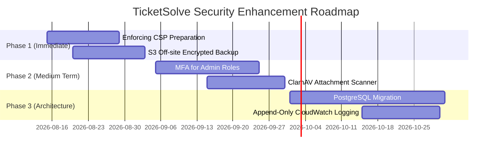

# 🛡️ TicketSolve - Risk Analysis & Security Mitigation Plan

**เอกสารวิเคราะห์ความเสี่ยงสำคัญและแผนยกระดับความปลอดภัย (Security Risk Analysis & Mitigation Roadmap)**

* **ระบบ**: TicketSolve Multi-Tenant IT Support Ticket System
* **เวอร์ชันเอกสาร**: 1.0.0
* **วันที่จัดทำ**: 8 สิงหาคม 2026
* **มาตรฐานอ้างอิง**: OWASP ASVS 5.0 Level 2, OWASP Top 10:2025, NIST CSF 2.0

---

## 📌 1. บทสรุปผู้บริหาร (Executive Summary)

ระบบ **TicketSolve** ได้รับการออกแบบสถาปัตยกรรมความปลอดภัยขั้นพื้นฐาน (Security Baseline) ครอบคลุมการควบคุมตัวตน (Authentication), การแยกขอบเขตข้อมูลรายบริษัท (Multi-tenant Isolation), การเข้ารหัสข้อมูลความลับ (Encryption at Rest) และการจำกัดสิทธิ์การทำงานในระดับแอปพลิเคชันและเว็บเซิร์ฟเวอร์เรียบร้อยแล้ว

อย่างไรก็ตาม เพื่อให้ระบบรองรับการใช้งานในระดับองค์กรและปฏิบัติตามกรอบมาตรฐานความปลอดภัยสากล ได้มีการวิเคราะห์และจัดลำดับความเสี่ยงสำคัญที่ยังคงเหลือในระบบ เพื่อกำหนดแผนรับมือและแนวทางแก้ไขอย่างเป็นรูปธรรม

---

## 📊 2. ตารางสรุปการประเมินความเสี่ยง (Risk Assessment Matrix)

| รายการความเสี่ยง (Risk Item) | ระดับความเสี่ยง | ผลกระทบ (Impact) | โอกาสเกิด (Likelihood) | สถานะปัจจุบัน | มาตรการแก้ไขที่เสนอ (Mitigation Strategy) |
|---|:---:|:---:|:---:|:---:|---|
| **1. สำรองข้อมูลบน VPS เดียวกับแอปพลิเคชัน (Single Point of Failure Backup)** | **สูง (High)** | เสียหายร้ายแรง (Data Loss) | ปานกลาง | สำรองข้อมูลบน VPS `/var/backups/` | ทำ Encrypted Off-site Backup ไปยัง AWS S3 พร้อม S3 Object Lock & Versioning |
| **2. ไม่มี Multi-Factor Authentication (MFA) สำหรับ System Admin** | **สูง (High)** | บัญชีผู้ดูแลถูกบุกรุก (Account Takeover) | ปานกลาง | มี Login Throttling + Argon2 | เพิ่ม TOTP / WebAuthn MFA สำหรับสิทธิ์ `SYSTEM_ADMIN` และ `SYSTEM_SUB_ADMIN` |
| **3. Content Security Policy (CSP) เป็นเพียง Report-Only Mode** | **กลาง (Medium)** | ความเสี่ยง XSS / Script Injection | ปานกลาง | CSP Header เป็น Report-Only | ย้าย inline script/style, เพิ่ม `nonce` token และเปลี่ยนเป็น Enforcing CSP |
| **4. ข้อจำกัด Concurrency และ High Availability ของ SQLite** | **กลาง (Medium)** | ระบบชะงักเมื่อมีการใช้งานพร้อมกันสูง | ต่ำ-ปานกลาง | SQLite3 + Online Backup API | ย้ายฐานข้อมูล Production ไปยัง PostgreSQL + TLS & Connection Pooling |
| **5. ไม่มี Malware / Anti-Virus Scanning สำหรับไฟล์แนบ** | **กลาง (Medium)** | ไฟล์แนบติดไวรัส/มัลแวร์กระจายสู่ผู้ใช้ | ปานกลาง | ตรวจ Signature & Extension Allowlist | เชื่อมต่อ ClamAV ICAP / File Quarantine Service ก่อนอนุญาตให้ดาวน์โหลด |
| **6. Audit Log จัดเก็บรวมในฐานข้อมูลเดียวกับระบบ** | **ต่ำ-กลาง (Low-Med)** | ผู้มีสิทธิ์สูงอาจดัดแปลงประวัติ Audit | ต่ำ | เก็บใน SQLite ตาราง `SecurityAuditLog` | ส่ง Structured Audit Logs ไปยัง AWS CloudWatch / External SIEM แบบ Append-Only |

---

## 🔍 3. รายละเอียดการวิเคราะห์ความเสี่ยง 6 ประการหลัก (Deep Dive Analysis)

### 3.1 📦 1. การสำรองข้อมูลนอกสถานที่ (Off-site Encrypted S3 Backup)

* **ความเสี่ยงปัจจุบัน**:
  - ไฟล์สำรองข้อมูล (Incremental, Full System, System Data) ถูกจัดเก็บอยู่บน AWS VPS เครื่องเดียวกับแอปพลิเคชัน (`/var/backups/ticketsolve`)
  - หากเกิดความเสียหายระดับฮาร์ดแวร์ ดิสก์ VPS สูญหาย หรือบัญชี VPS ถูกทำลาย ข้อมูลทั้งหมดจะถูกลบและไม่สามารถกู้คืนได้ (Single Point of Failure)
* **แผนดำเนินการแก้ไข (Mitigation Plan)**:
  1. สร้าง **AWS S3 Bucket** แยกบัญชีหรือแยกภูมิภาค (Cross-Region)
  2. เปิดใช้งาน **S3 Object Lock (Compliance Mode)** ป้องกันไม่ให้ไฟล์สำรองถูกลบหรือแก้ไขแม้แต่จากบัญชี Root ก่อนครบกำหนด Retention
  3. เข้ารหัสไฟล์สำรองก่อนส่งออกด้วย `AES-256` (GPG / Fernet encryption)
  4. เขียนสคริปต์ Sync อัตโนมัติผ่าน AWS CLI หรือ SDK หลังการทำ Backup สำเร็จ

---

### 🔑 3.2 2. ระบบยืนยันตัวตนสองปัจจัย (MFA for Privileged Roles)

* **ความเสี่ยงปัจจุบัน**:
  - ผู้ดูแลระบบสิทธิ์สูง (`SYSTEM_ADMIN`, `SYSTEM_SUB_ADMIN`) ยังคงใช้การยืนยันตัวตนด้วยรหัสผ่านเพียงปัจจัยเดียว (Single-Factor Authentication)
  - แม้จะมีระบบ Login Throttling ล็อกเมื่อกรอกผิดครบ 5 ครั้ง แต่หากรหัสผ่านหลุดรอด (เช่น Credential Leaks ข้ามเว็บ) ผู้บุกรุกสามารถเข้าถึงข้อมูลทุกบริษัทได้
* **แผนดำเนินการแก้ไข (Mitigation Plan)**:
  1. ติดตั้งไลบรารี `django-otp` / `pyotp` รองรับ Time-based One-Time Password (TOTP) เช่น Google Authenticator / 1Password
  2. บังคับใช้ MFA สำหรับบทบาท `SYSTEM_ADMIN` และ `SYSTEM_SUB_ADMIN` ทุกครั้งที่เข้าสู่ระบบ
  3. สร้าง Backup Recovery Codes แบบใช้งานครั้งเดียว (Single-use) เก็บในรูปแบบ Hashed

---

### 🛡️ 3.3 3. การปรับเปลี่ยนนโยบายความปลอดภัยเป็น Enforcing CSP

* **ความเสี่ยงปัจจุบัน**:
  - ปัจจุบันระบบใช้ HTTP Header `Content-Security-Policy-Report-Only` เพื่อป้องกันไม่ให้กระทบต่อ Tailwind CSS CDN และ Google Fonts
  - เบราว์เซอร์จะไม่บล็อกสคริปต์แปลกปลอมหากเกิดช่องโหว่ XSS
* **แผนดำเนินการแก้ไข (Mitigation Plan)**:
  1. **Self-host Frontend Assets**: ดาวน์โหลดไฟล์ Tailwind CSS และฟอนต์ภาษาไทยมาไว้ที่ `static/` ในระบบ
  2. **Strict Nonce Implementation**: เพิ่ม Django Middleware สร้าง `nonce` token แบบสุ่มสำหรับทุก Request และระบุ `<script nonce="{{ request.csp_nonce }}">`
  3. เปลี่ยน HTTP Header เป็น `Content-Security-Policy` เพื่อสกัดกั้นสคริปต์ที่ไม่ได้รับอนุมัติทันที 100%

---

### 🗄️ 3.4 4. การย้ายฐานข้อมูลไป PostgreSQL (Enterprise Scalability & HA)

* **ความเสี่ยงปัจจุบัน**:
  - SQLite3 ทำงานได้ดีสำหรับแอปพลิเคชันขนาดกลาง แต่มีข้อจำกัดเรื่อง Write-Lock Concurrency เมื่อมี Gunicorn Workers และ Background Schedulers ทำงานพร้อมกันหลาย Process
* **แผนดำเนินการแก้ไข (Mitigation Plan)**:
  1. ติดตั้ง PostgreSQL 16+ บน Managed Database (เช่น AWS RDS PostgreSQL) หรือ VPS แยกต่างหาก
  2. เปิดใช้งาน TLS/SSL Connection จาก Django มายัง Database
  3. ตั้งค่า `CONN_MAX_AGE` และ Connection Pooling (PgBouncer)
  4. ทำ Data Migration ด้วย `python manage.py dumpdata` และ `loaddata`

---

### 🦠 3.5 5. ระบบสแกนไวรัสและมัลแวร์สำหรับไฟล์แนบ (Malware Scanning)

* **ความเสี่ยงปัจจุบัน**:
  - การอัปโหลดไฟล์แนบรองรับเฉพาะการตรวจ Magic File Signature, Extension Allowlist และ Office Macro/Zip Bomb
  - ไม่สามารถตรวจจับ Zero-day Malware หรือ Payload ซ่อนเร้นภายในไฟล์เอกสาร/รูปภาพได้
* **แผนดำเนินการแก้ไข (Mitigation Plan)**:
  1. ติดตั้ง **ClamAV Daemon (`clamd`)** บนเซิร์ฟเวอร์
  2. ก่อนย้ายไฟล์จาก Staging area เข้าสู่ `media/` จริง ให้รันการสแกนผ่าน Socket/Stream
  3. หากพบมัลแวร์ ให้ทำการ Quarantine ไฟล์ ย้ายเข้าโฟลเดอร์กักกัน และลบออกจากระบบทันที พร้อมส่งแจ้งเตือนไปยัง Security Audit Log

---

### 📜 3.6 6. ระบบบันทึก Log ความปลอดภัยแบบภายนอก (Append-Only Centralized Logging)

* **ความเสี่ยงปัจจุบัน**:
  - ประวัติความปลอดภัย (`SecurityAuditLog`) ถูกจัดเก็บในตาราง SQLite เดียวกับข้อมูลระบบ
  - หากผู้บุกรุกสิทธิ์สูงสามารถยึดฐานข้อมูลได้ อาจพยายามแก้ไขหรือลบประวัติการบุกรุก (Tampering)
* **แผนดำเนินการแก้ไข (Mitigation Plan)**:
  1. กำหนดโครงสร้าง Log เป็น JSON Standard (Structured Logging)
  2. ส่งผ่าน `rsyslog` / `Fluentd` ไปยัง **AWS CloudWatch Logs** หรือ **SIEM System** แบบ Append-Only (เขียนได้อย่างเดียว ลบไม่ได้)
  3. ตั้งค่า Real-time Alerting เมื่อพบเหตุการณ์ `LOGIN_BLOCKED` หรือ `UNAUTHORIZED_ACCESS` ถี่ผิดปกติ

---

## 🚀 4. แผนงานการดำเนินการ (Implementation Roadmap)

---

## 📑 5. ตำแหน่งการจัดเก็บเอกสารและอ้างอิง (Document Index)

เอกสารฉบับนี้ถูกอ้างอิงและบันทึกไว้ในส่วนสำคัญของโปรเจค เพื่อให้ทั้งทีมพัฒนาและ AI Agents ใช้เป็นคู่มืออ้างอิงมาตรฐาน:

1. **Root Workspace**: `RISK_ANALYSIS_AND_MITIGATION_PLAN.md` (ไฟล์หลักประจำโปรเจค)
2. **Skill Reference**: `.agents/skills/ticketsolve-dev/references/risk-analysis.md` (อ้างอิงสำหรับ AI Agent)
3. **Architecture Core Report**: `SECURITY_AND_SYSTEM_ARCHITECTURE_REPORT.md`
