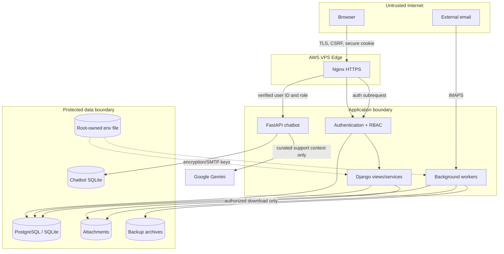
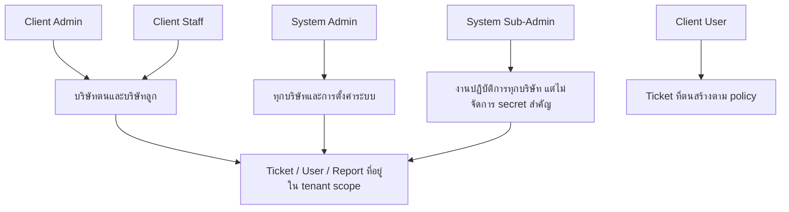

# รายงานความปลอดภัยและสถาปัตยกรรมระบบ TicketSolve

วันที่ประเมินและปรับปรุง: 12 สิงหาคม 2026
ขอบเขต: source code, Django/FastAPI, RBAC/tenant isolation, Email integration, AI chatbot, backup, Nginx, Gunicorn/systemd, dependencies และ automated tests

> สถานะของเอกสาร: เป็นการวาง baseline และปรับให้สอดคล้องกับแนวปฏิบัติสากล ไม่ใช่ใบรับรอง ISO 27001, SOC 2 หรือการรับรอง OWASP ASVS จากหน่วยงานภายนอก การรับรองอย่างเป็นทางการยังต้องมี governance, evidence, penetration test และ auditor อิสระ

## 1. บทสรุปผู้บริหาร

กำหนดเป้าหมายด้าน application security ที่ **OWASP ASVS 5.0 ระดับ 2** สำหรับระบบเว็บที่มีข้อมูลธุรกิจ ร่วมกับ **OWASP Top 10:2025**, **NIST Cybersecurity Framework 2.0** และ Django deployment checklist

รอบนี้ลดความเสี่ยงสำคัญดังนี้:

- ป้องกัน brute force/credential stuffing ด้วย rate limit สองชั้น: Django บันทึกต่อบัญชีและ IP และ Nginx จำกัด endpoint `/login/`
- ใช้ Argon2 เป็น password hasher หลัก, รหัสผ่านใหม่ขั้นต่ำ 12 ตัวอักษร และจำกัดอายุ session
- เปลี่ยน logout เป็น `POST` พร้อม CSRF และปิด open redirect จาก `next`/`Referer`
- เข้ารหัส SMTP/IMAP password ในฐานข้อมูลด้วย Fernet โดย key แยกจากฐานข้อมูล, Git และ backup
- ตรวจไฟล์แนบด้วย allowlist + file signature ทุกช่องทาง รวม Ticket, Comment และ Email → Ticket พร้อมป้องกัน Office macro/zip bomb เบื้องต้น
- เพิ่ม approval gate ก่อนอีเมลภายนอกมีสิทธิ์สร้าง Ticket พร้อม private staged attachments, authenticated download, audit ผู้ตัดสินใจ และลบไฟล์ชั่วคราวเมื่อจบการพิจารณา
- เพิ่ม Security Audit Log โดยไม่เก็บ username/IP ของ anonymous login เป็นข้อความตรง แต่เก็บ HMAC fingerprint
- เพิ่ม Simple Password แบบ admin-approved สำหรับผู้สูงอายุหรือผู้ใช้ที่ไม่ถนัดเทคโนโลยี: อนุญาตรหัสอย่าง `123456` เฉพาะบัญชีที่ได้รับอนุมัติ, เก็บเป็น Argon2 hash, ใช้ต่อเนื่องได้ และ lock 10 นาทีหลังผิดครบ 5 ครั้ง โดยไม่เปิดทางให้ดึงรหัสเดิมย้อนหลัง
- เพิ่ม security headers, HSTS preload, authenticated-page no-store และ hardening ของ Nginx/Gunicorn service
- ปิด unauthenticated Chatbot Admin/API โดยใช้ Nginx `auth_request` ผูก Django session/RBAC, จำกัด CORS/origin/rate/body, ไม่ส่ง Gemini API key กลับ browser และย้าย DB/key ออกจาก Git checkout
- แก้ Email Approval regression: Address Book ไม่เท่ากับการอนุมัติ ผู้ส่งจะ auto-import ได้เมื่อเคย import สำเร็จ, เป็น user ในระบบ หรือมี routing rule เท่านั้น
- ปิด tenant enumeration และ stored-XSS ใน Email Recipient Preview พร้อมตรวจ email override, จำกัด 20 รายการ และไม่ให้ Client User ส่ง ticket content ไป arbitrary email
- ตรึงเวอร์ชัน production dependencies, อัปเดต `cryptography` จาก 49.0.0 ไป 50.0.0 ตาม advisory และตรวจพบ **0 known vulnerabilities** ด้วย `pip-audit` ณ วันที่รายงาน
- เพิ่ม security regression tests, Simple Password, Email approval/RBAC, PDF ภาษาไทย และ Chatbot security; Django 106 tests + FastAPI 10 tests

## 2. มาตรฐานอ้างอิงและเป้าหมาย

| กรอบมาตรฐาน | การนำมาใช้ในระบบ | สถานะ |
|---|---|---|
| OWASP ASVS 5.0 L2 | authentication, session, access control, validation, cryptography, logging, files, configuration | สอดคล้องบางส่วนและมีรายการคงเหลือด้านล่าง |
| OWASP Top 10:2025 | ลด A01 access control, A02 misconfiguration, A03 supply chain, A04 cryptography, A05 injection/file input, A07 authentication และ A09 logging | ดำเนินการใน code/deployment baseline |
| NIST CSF 2.0 | Govern, Identify, Protect, Detect, Respond, Recover | มี technical controls; governance/IR exercise ต้องดำเนินต่อเนื่อง |
| Django 5.2 deployment checklist | secret management, HTTPS, secure cookies, HSTS, allowed hosts, deploy checks | `manage.py check --deploy` ผ่าน |

## 3. ภาพรวมระบบทั้งหมด

### 3.1 ความสามารถหลัก

1. Multi-tenant Ticket Management: สร้าง แก้ไข จัดลำดับความสำคัญ เปลี่ยนสถานะ มอบหมาย ลบ และติดตาม Ticket
2. Company hierarchy: บริษัทแม่/บริษัทลูก พร้อมขอบเขตการมองเห็นตาม tenant
3. RBAC 5 ระดับ: System Admin, System Sub-Admin, Client Admin, Client Staff และ Client User
4. Custom ticket design: หมวดหมู่, module, resolution, prefix และ custom fields รายบริษัท
5. Comments/attachments: ความคิดเห็นและไฟล์แนบหลายไฟล์ พร้อม authenticated download
6. Notification: อีเมลตาม event/rule และ in-app notification ส่วนตัว
7. Email → Ticket: อ่าน IMAP ตาม timer, กรองหัวข้อ, ป้องกัน Message-ID ซ้ำ, เก็บสมุดรายชื่อ, รออนุมัติก่อนสร้าง Ticket และ route ผู้ดูแลตาม sender
8. Outbound SMTP: แยก scope ส่งอีเมล/นำอีเมลเข้า/ทั้งสอง และ simulation mode
9. Automation: เปลี่ยนสถานะ Ticket ตามเวลา และ scheduler สำหรับงานระบบ
10. Monthly PDF report: preview, ส่งทันที, To/CC, schedule รายเดือน และฝังฟอนต์ Sarabun สำหรับภาษาไทย
11. Audit/logs: Ticket audit, email delivery, email import details, execution log, backup log และ security audit
12. Backup บน AWS VPS: incremental, full และ system data without tickets พร้อม schedule/manual/download/delete/retention
13. AI support chatbot: Gemini guidance จาก curated knowledge, authenticated widget, System Admin panel และ isolated audit/data store
14. Operations: Nginx TLS, Gunicorn, FastAPI/Uvicorn, systemd services/timers และ deployment script

### 3.2 แผนผังสถาปัตยกรรม

```mermaid
flowchart LR
    U[ผู้ใช้ผ่าน HTTPS] --> N[Nginx TLS / rate limit]
    N --> G[Gunicorn]
    G --> D[Django TicketSolve]
    D --> DB[(PostgreSQL production / SQLite development)]
    D --> M[(Private media files)]
    D --> SMTP[SMTP provider]
    IMAP[IMAP mailbox] --> E[Email-to-Ticket worker]
    E --> Q[Approval queue + contacts]
    Q -->|Approve| DB
    Q -->|Private staged files| M
    Q -->|Reject / cleanup| M
    T1[systemd scheduler timer] --> S[Report / Automation / Backup jobs]
    T2[Email timer] --> E
    S --> DB
    S --> B[(AWS VPS backup directory)]
    D --> B
    N -->|auth_request| D
    N -->|Authenticated identity headers| C[FastAPI Chatbot]
    C --> CDB[(Chatbot SQLite)]
    C --> GEM[Google Gemini API]
    K[/etc/ticketsolve/ticketsolve.env] -. secrets .-> G
    K -. secrets .-> E
    K -. secrets .-> S
```

### 3.3 Trust boundaries และเส้นทางข้อมูล



### 3.4 ลำดับสิทธิ์และ tenant isolation



## 4. สิ่งที่แก้ไขและวิธีดำเนินการ

| พื้นที่ | ก่อนแก้ | การแก้ไข | ไฟล์สำคัญ |
|---|---|---|---|
| Login | ไม่มี application throttling | จำกัด 5 ครั้ง/15 นาทีต่อ account และ IP, lock 15 นาที, HTTP 429 + Retry-After | `tickets/security.py`, `tickets/models.py`, `tickets/views.py` |
| Password | PBKDF2 default, minimum 8 | Argon2 default, minimum 12, PBKDF2 fallback รองรับ hash เดิม | `ticket_system/settings.py`, `requirements.txt` |
| Session/logout | session default และ logout GET | 8 ชั่วโมง + browser-close; logout POST + CSRF | settings, views, base template |
| Redirect | รับ `next`/Referer โดยตรงบางจุด | ตรวจ host/scheme และ fallback เป็น internal URL | `tickets/security.py`, `tickets/views.py` |
| SMTP secrets | password เป็น plaintext column | `EncryptedCharField` + Fernet; migration เข้ารหัสค่าที่มีอยู่; key อยู่นอก repository | security, models, migration 0030, deploy script |
| Upload | ตรวจจำนวนและขนาด | allowlist, signature, UTF-8/no-NUL, Office container, macro และ expansion ratio | security, views, email import |
| Audit | มี Ticket/email/backup logs | เพิ่ม login success/failure/blocked, logout, SMTP changes, ticket delete, manual backup/delete | models, views, Logs UI |
| HTTP headers | Django basic headers | Permissions-Policy, CORP, cross-domain policy, no-store และ CSP Report-Only | middleware/settings |
| Reverse proxy | upload 110 MB, ไม่มี login limit | upload 60 MB, login limit, timeouts, hide server version | `deployment/nginx.conf` |
| Runtime | systemd hardening บางส่วน | ProtectSystem/Home/kernel/control groups, private devices, no capabilities | `deployment/gunicorn.service` |
| Supply chain | dependency ranges | pin direct versions; Argon2/cryptography explicit; audit dependencies | `requirements.txt` |
| Deployment | สร้างเฉพาะ SECRET_KEY | แยก FIELD_ENCRYPTION_KEYS, สำรอง env แบบ root-only และหยุดก่อนเปลี่ยน key เมื่อพบ ciphertext ที่ไม่มี key; HSTS preload; permission 0640 | `deployment/deploy.sh`, `.env.example` |

Migration `0030_security_baseline` ทำสามอย่างแบบอัตโนมัติ: สร้างตาราง throttle, สร้าง security audit table และแปลง SMTP password เดิมเป็น ciphertext การ rollback ไม่ถอดรหัสกลับเป็น plaintext เพื่อไม่ลดระดับความปลอดภัย

## 5. การควบคุมที่มีอยู่ก่อนและยังคงใช้

- Central permission querysets บังคับ tenant scope และมี regression tests ข้ามบริษัท
- System Admin ที่ไม่ใช่ Django superuser ไม่สามารถแก้ไข/ยกระดับ superuser
- ไฟล์ `/media/` เปิดตรงผ่าน Nginx ไม่ได้; download ผ่าน view ที่ตรวจสิทธิ์และบังคับ attachment/no-store/nosniff
- CSRF middleware, ORM, template auto-escaping, HTTPS redirect, secure/HttpOnly/SameSite cookies และ HSTS 1 ปี
- Email body แปลง HTML เป็น plain text, จำกัด raw email/body/file count/size และป้องกัน import ซ้ำด้วย Message-ID
- Backup ใช้ file lock, ตรวจ resolved path, retention และไม่รวม runtime secret file
- Production secrets อยู่ `/etc/ticketsolve/ticketsolve.env` permission root:www-data 0640

## 6. ผลการตรวจสอบ

| การตรวจ | ผลล่าสุด |
|---|---|
| `python manage.py check` | ผ่าน: 0 issues |
| `python manage.py check --deploy` | ผ่าน: 0 issues |
| `python manage.py makemigrations --check` | ผ่าน: no changes detected |
| Django regression suite | 106/106 ผ่าน |
| FastAPI Chatbot suite | 10/10 ผ่าน |
| `check --deploy` / migration check / template-script check | ผ่าน |
| `pip-audit` main + chatbot requirements | No known vulnerabilities found ณ 12 ส.ค. 2026 |

## 7. ความเสี่ยงคงเหลือและลำดับถัดไป

| ระดับ | ความเสี่ยงคงเหลือ | ข้อเสนอแนะ |
|---|---|---|
| สูง | Backup อยู่ VPS เดียวกับระบบ จึงไม่ทนต่อ disk/VPS/account failure | ทำ encrypted off-host copy ไป S3 คนละ credential/account, เปิด versioning/Object Lock และทดสอบ restore รายไตรมาส |
| สูง | ยังไม่มี MFA สำหรับบัญชี System Admin | เพิ่ม WebAuthn/TOTP, recovery codes และบังคับ MFA สำหรับ privileged roles |
| กลาง | CSP ยังเป็น Report-Only เพราะ template มี inline script/style และ Tailwind CDN | self-host frontend assets, ย้าย inline handlers/scripts, ใช้ nonce/hash แล้วเปลี่ยนเป็น enforcing CSP |
| กลาง (แก้ไขแล้ว) | SQLite กับหลาย Gunicorn workers/schedulers มีข้อจำกัด concurrency และ HA | **ดำเนินการแก้ไขแล้ว**: ระบบปรับรองรับ PostgreSQL 16+ Dual-Engine via Environment Variables (`DB_ENGINE`) พร้อม Connection Pooling และ Database-Agnostic Backup Service (`tickets/backup_service.py`) |
| กลาง | SMTP/IMAP แบบรหัสผ่านยังขึ้นกับ provider policy | ใช้ OAuth2/Google Workspace/Microsoft Graph และหมุน app password ที่ยังจำเป็น |
| กลาง | ไม่มี malware sandbox/AV สำหรับไฟล์แนบ | เพิ่ม ClamAV หรือ object-storage scanning/quarantine ก่อนให้ดาวน์โหลด |
| กลาง | Audit log อยู่ฐานข้อมูลเดียวและผู้มีสิทธิ์สูงอาจกระทบ evidence | ส่ง structured security logs ไป CloudWatch/SIEM แบบ append-only พร้อม alert |
| ต่ำ | Direct dependencies ถูก pin แต่ยังไม่มี lockfile พร้อม hash | ใช้ `pip-tools`/constraints with hashes และ CI dependency audit/SBOM |

## 8. แผนดำเนินงานด้านความปลอดภัย

### ทุกวัน

- ตรวจ service/timer failures, disk usage, backup failure และ LOGIN_BLOCKED ที่ผิดปกติ
- ตรวจ certificate expiry และ error rate ของ Nginx/Gunicorn

### ทุกสัปดาห์

- รัน test suite, `manage.py check --deploy` และ `pip-audit`
- ทบทวน privileged login, SMTP configuration changes และ destructive actions
- ยืนยันว่ามี backup ล่าสุดครบทั้ง incremental/full/system data

### ทุกเดือน

- patch OS/Python packages, review user/role/company assignments และปิดบัญชีที่ไม่ใช้
- หมุน app password ตาม provider policy และตรวจ key inventory
- ทดสอบ restore แบบสุ่มอย่างน้อยหนึ่ง archive ใน isolated environment

### ทุกไตรมาส

- tabletop incident-response exercise และ restore drill แบบครบระบบ
- vulnerability scan/penetration test โดยเน้น tenant isolation, IDOR, upload และ authentication
- ทบทวน threat model, retention, RTO/RPO และ off-site backup evidence

### ขั้นตอนเมื่อเกิดเหตุ

1. Identify: เก็บเวลา, account, event type และ scope โดยไม่ลบ log
2. Contain: disable account/config, revoke session/credential และ isolate service ตามขอบเขต
3. Eradicate: patch root cause, rotate `SECRET_KEY`/SMTP/Fernet key ตามชนิดเหตุ และสแกน persistence
4. Recover: restore จากสำเนาที่ตรวจ integrity, migrate, smoke test และเฝ้าระวัง
5. Lessons learned: บันทึก timeline, impact, corrective action, owner และ deadline

## 9. การหมุน FIELD_ENCRYPTION_KEYS อย่างปลอดภัย

1. สร้าง Fernet key ใหม่และวางไว้ตัวแรก: `FIELD_ENCRYPTION_KEYS=new_key,old_key`
2. restart services แล้วตรวจว่าอ่าน SMTP config เดิมได้
3. บันทึก SMTP config แต่ละรายการใหม่เพื่อ re-encrypt ด้วย key แรก หรือใช้ management command ที่ผ่านการ review
4. สำรอง key ตาม secret-management policy และตรวจ raw database ว่าไม่มี token ที่ใช้ old key
5. นำ old key ออกหลัง backup/rollback window สิ้นสุด ห้ามหมุน `SECRET_KEY` แทน field key

## 10. เกณฑ์ยอมรับก่อน production release

- code review อย่างน้อยหนึ่งคนสำหรับ permission, crypto, upload, backup และ migration changes
- CI tests/check/dependency audit ผ่าน และ migration ทดลองกับสำเนาฐานข้อมูล
- `/etc/ticketsolve/ticketsolve.env` มี unique SECRET_KEY และ FIELD_ENCRYPTION_KEYS; ไม่ปรากฏใน Git/backup/log
- Nginx config test ผ่าน, service sandbox ไม่ขัดขวาง media/database/backup ที่จำเป็น
- smoke test login/logout, tenant access, attachment, SMTP, Email → Ticket, report และ backup/restore
- มี rollback plan ที่ไม่ลด SMTP password กลับเป็น plaintext

## 11. เอกสารอ้างอิงทางการ

- [OWASP Application Security Verification Standard 5.0](https://owasp.org/www-project-application-security-verification-standard/)
- [OWASP Top 10:2025](https://owasp.org/Top10/2025/0x00_2025-Introduction/)
- [NIST Cybersecurity Framework 2.0](https://www.nist.gov/publications/nist-cybersecurity-framework-csf-20)
- [Django 5.2 security documentation](https://docs.djangoproject.com/en/5.2/internals/security/)
- [Django deployment checklist](https://docs.djangoproject.com/en/5.2/howto/deployment/checklist/)
