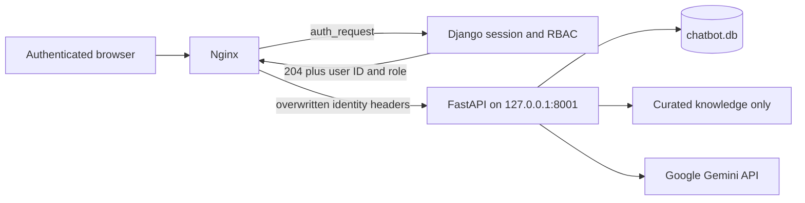

# TicketSolve Gemini Chatbot Microservice

ปรับปรุงล่าสุด: 12 สิงหาคม 2026

FastAPI microservice สำหรับตอบคู่มือ TicketSolve ผ่าน Google Gemini โดยทำงานบน
`127.0.0.1:8001` หลัง Nginx เท่านั้น ระบบนี้ไม่สามารถแก้ Ticket, อ่านฐานข้อมูล
Ticket หรือเรียก shell command ได้

## Request flow



- `/api/status` และ `/api/chat`: ต้องมี Django session ที่ login แล้ว
- `/chatbot-admin/` และ `/api/admin/*`: เฉพาะ `SYSTEM_ADMIN`,
  `SYSTEM_SUB_ADMIN` หรือ Django superuser
- `/chatbot-static/`: static widget; ไม่มีข้อมูลส่วนตัว
- `/api/chat` จำกัดสองชั้น: Nginx edge 120 requests/minute/IP และ FastAPI
  20 requests/minute/Django user พร้อมจำกัด request body
- FastAPI ปฏิเสธ identity header ที่หายไป; Nginx เขียน header นี้ทับค่าจาก client
- Admin POST ต้องมาจาก Origin/Referer ของ TicketSolve ที่อนุญาต

## Data and secrets

| Item | Production path | Permission/purpose |
|---|---|---|
| Runtime database | `/var/lib/ticketsolve-chatbot/chatbot.db` | SQLite; owner `ticketsolve-chatbot`, mode `0640` |
| Fernet key | `/etc/ticketsolve/chatbot-fernet.key` | root-owned, readable only by chatbot group |
| Curated documents | `chatbot_service/knowledge/` | read-only, `.md`/`.txt` only |

API key ถูกเข้ารหัสด้วย Fernet แต่หน้า Admin แสดงเพียงสถานะว่า “configured” และไม่ส่ง
ค่าที่ถอดรหัสกลับ browser ช่อง API key ที่เว้นว่างหมายถึงเก็บค่าเดิม การเปลี่ยน config,
knowledge และการลบ knowledge ถูกบันทึกใน `admin_audit_log` โดยไม่เก็บ secret หรือ
เนื้อหา prompt

Full Backup และ System Data Backup เก็บ snapshot ของ `chatbot.db` ด้วย แต่ไม่รวม
Fernet key ดังนั้นต้องสำรอง key ใน approved secret store แยกต่างหาก

## Security boundaries

- ไม่มีบัญชี admin/password แยกของ FastAPI และไม่มี default credential
- CORS ใช้ explicit TicketSolve origins; ไม่ใช้ wildcard
- จำกัดข้อความผู้ใช้ 2,000 ตัวอักษร, system prompt 8,000 ตัวอักษร และ knowledge
  30,000 ตัวอักษรต่อรายการ
- โมเดลที่รองรับเป็น allowlist; ค่าแนะนำคือ `gemini-3.6-flash`
- Repository README, deployment report, `.env`, source code และ user uploads ไม่ถูกส่ง
  ให้โมเดล ใช้เฉพาะ curated guide กับ knowledge ที่ System Admin เพิ่ม
- Provider error ถูกเก็บเป็น log แบบไม่เปิดเผยรายละเอียดภายในแก่ผู้ใช้
- systemd ใช้ dedicated user, read-only filesystem, no-new-privileges, capability drop,
  memory/tasks/file-descriptor limits

## Operations

```bash
sudo systemctl status ticket-chatbot --no-pager
sudo journalctl -u ticket-chatbot --no-pager -n 100
sudo systemctl restart ticket-chatbot
```

หลังเปลี่ยน Nginx หรือ RBAC ต้องใช้ full deployment เพื่อให้ auth subrequest, service
unit และ data permissions ถูกติดตั้งพร้อมกัน ไม่ควร copy เฉพาะ `main.py` ไป production

## Tests

```bash
python -m pytest chatbot_service -q
python manage.py test
```

Regression tests ครอบคลุม unauthenticated access, role enforcement, same-origin admin
mutation, secret non-disclosure, payload limits, deprecated model rejection, audit log และ
document sandbox
