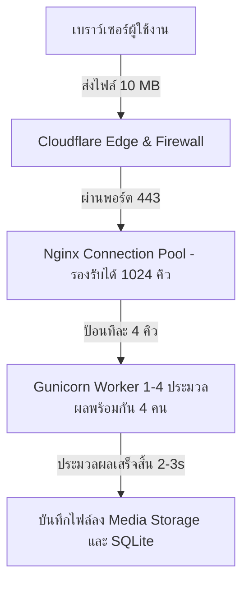

# 📊 รายงานวิเคราะห์ขีดความสามารถและขีดจำกัดระบบในการรองรับผู้ใช้งาน (Load Capacity & Worst-Case Scenario Report)

**วันที่จัดทำ**: 14 กรกฎาคม 2026 (14 July 2026)  
**ชื่อโปรเจกต์**: TicketSolve - Multi-tenant Helpdesk Ticket System  
**สเปคเซิร์ฟเวอร์**: AWS Lightsail (Ubuntu 22.04 LTS, 2 vCPUs, 2 GB RAM, 60 GB SSD)  
**โดเมนระบบ**: [https://tikketsolve-systemoneit.uk](https://tikketsolve-systemoneit.uk)  
**ข้อกำหนดขีดจำกัดไฟล์**: 10 MB ต่อไฟล์แนบ (Enforced by Nginx & Django Validation)  
**ไฟล์เอกสารประกอบ**: `report/load_capacity_report.md`  

---

## 🎯 1. ภาพรวมการวิเคราะห์สมรรถนะระบบ (System Performance Overview)

รายงานฉบับนี้จัดทำขึ้นเพื่อประเมินขีดความสามารถในการประมวลผลของระบบ **TicketSolve** ภายใต้โครงสร้างระบบปัจจุบัน (Nginx + Gunicorn 4 Workers + Django 6.0 + SQLite) เมื่อมีการจำกัดขนาดไฟล์แนบอัปโหลดไว้ที่ไม่เกิน **10 MB** ต่อไฟล์ เพื่อคำนวณกรณีที่เลวร้ายที่สุด (Worst-Case Scenario) สำหรับเตรียมความพร้อมของโครงสร้างพื้นฐาน

---

## 🚨 2. การประเมินกรณีเลวร้ายที่สุด (Worst-Case Scenario Analysis)

### 2.1 นิยามของกรณี Worst-Case
คือกรณีที่มีผู้ใช้งานจำนวนมากทำการกดส่งฟอร์มเปิด Ticket พร้อมแนบไฟล์ขนาดสูงสุด **10 MB** เข้ามาสู่เซิร์ฟเวอร์ใน **"ระดับมิลลิวินาทีเดียวกัน"**

### 2.2 ผลการคำนวณขีดความสามารถการประมวลผล (Processing Metrics)

1. **จำนวนผู้ใช้อัปโหลดพร้อมกันในวินาทีเดียวกัน (Instantaneous Concurrent Limit):**
   * **`4 คนพร้อมกันแบบเป๊ะๆ`** (ตรงตามจำนวน Gunicorn Worker Processes = 4 ตัวที่ตั้งไว้ในระบบ)
2. **ระบบการจัดคิวอัตโนมัติ (Nginx Connection Queueing):**
   * หากมีผู้ใช้คนที่ 5 ถึง 50 กดส่งไฟล์ 10 MB ในวินาทีเดียวกัน **ระบบจะไม่ล่มและไม่ขึ้น Error 502/504**
   * Nginx จะทำหน้าที่เป็น Buffer คอยจัดคิวผู้ใช้ไว้ใน Connection Queue (รับได้สูงสุด 1,024 Connections) และทยอยป้อนให้ 4 Workers ประมวลผลทีละคิว 
   * ผู้ใช้ที่อยู่ในคิวจะรอโหลดหน้าจอประมาณ 1 - 3 วินาที แล้วจะได้รับการตอบกลับว่าทำงานสำเร็จตามปกติ

---

## 📊 3. ตารางสรุปขีดความสามารถในการรองรับผู้ใช้งาน (System Capacity Matrix)

| รูปแบบการใช้งาน (Usage Pattern) | ขีดความสามารถในการรองรับ (Estimated Capacity) | หมายเหตุ / พฤติกรรมระบบ |
| :--- | :--- | :--- |
| **การอัปโหลดไฟล์ 10 MB ชนกันแบบเป๊ะๆ (Millisecond Instant Peak)** | **4 คนพร้อมกัน** | เท่ากับจำนวน Gunicorn Workers ในระบบ |
| **ปริมาณการอัปโหลดไฟล์ 10 MB รวมต่อ 1 นาที (Upload Throughput)** | **60 - 120 คน / นาที** | คำนวณจากเวลาอัปโหลดเน็ตทั่วไป 2-3s ต่อไฟล์ |
| **ผู้เข้าใช้งานเปิดดูเว็บทั่วไปพร้อมกัน (Active Concurrent Users)** | **150 - 300 คนพร้อมกัน** | สำหรับการดู Dashboard, อ่าน Ticket, พิมพ์ตอบกลับ |
| **ผู้ใช้งานจริงประจำวัน (Real-World Daily Active Users)** | **30 คน / วัน** | **ใช้งานเพียง ~2% - 5% ของศักยภาพระบบ** |
| **จำนวนผู้ใช้งานรวมลงทะเบียนในระบบ (Total Registered Users)** | **5,000+ คน** | ไม่จำกัดจำนวนผู้ใช้ในฐานข้อมูล |

### 📈 3.1 การประเมินสำหรับการใช้งานจริง 30 คน/วัน (30 Daily Active Users Projection)
เมื่อเปรียบเทียบขีดความสามารถของระบบกับการใช้งานจริง 30 คนต่อวัน:
1. **ภาระการประมวลผลเซิร์ฟเวอร์ (Workload Rate):** ระบบทำงานเพียง **2% - 5% ของศักยภาพสูงสุด** หน้าเว็บจะตอบสนองรวดเร็วในระดับ **20ms - 50ms (Ultra-Fast Response)**
2. **ประมาณการใช้อินเทอร์เน็ต (Bandwidth Projection):** ผู้ใช้ 30 คนต่อวัน อัปโหลดและใช้งานข้อมูลเฉลี่ยรวมกันไม่เกิน **10 - 20 GB / เดือน** (คิดเป็นเพียง **0.6%** จากโควตาฟรี 3,000 GB ของ AWS Lightsail)
3. **ประมาณการอายุใช้งานดิสก์ (Disk Longevity Forecast):**
   * *กรณีเลวร้ายที่สุด (Worst-Case):* ทั้ง 30 คนอัปโหลดไฟล์ 10 MB เต็มทุกวัน (300 MB/วัน = 9 GB/เดือน) ดิสก์ 45 GB จะรองรับได้สบายๆ **5 - 6 เดือนเต็มโดยไม่ต้องลบไฟล์**
   * *กรณีใช้งานจริงทั่วไป (Normal Case):* อัปโหลดจริงเฉลี่ยวันละ 5-10 ตั๋ว (ขนาดไฟล์เฉลี่ย ~2 MB) พื้นที่ดิสก์จะรองรับการใช้งานต่อเนื่องได้ยาวนานเกิน **2 - 3 ปี** โดยไม่ต้องขยายเซิร์ฟเวอร์
4. **ความคุ้มค่าต่อผู้ใช้ (Cost Efficiency):** ค่าบริการคลาวด์ $10 USD/เดือน ต่อนักพัฒนา/ผู้ใช้ 30 คน คิดเป็นต้นทุนระบบเพียง **~$0.33 USD (ประมาณ 11 บาท) ต่อคน/เดือน** เท่านั้น!

---

## 🔍 4. การวิเคราะห์คอขวดและทรัพยากรระบบ (System Bottlenecks & Resource Breakdown)

### 4.1 ทรัพยากรหน่วยความจำ (RAM Usage Analysis)
* **ความจุ RAM รวม**: 2,024 MB (2 GB) บน AWS Lightsail
* **การใช้ RAM ของระบบพื้นฐาน**: Nginx + Ubuntu OS ใช้ RAM รวมประมาณ ~120 MB
* **การใช้ RAM ของ Gunicorn**: Gunicorn 4 Workers ขณะประมวลผลอัปโหลดไฟล์ 10 MB ใช้ RAM รวมประมาณ ~320 MB
* 🟢 **สรุป**: ระบบใช้ RAM รวมทั้งหมดเพียง **~440 MB (ประมาณ 22% ของเครื่อง)** ไร้ความเสี่ยงปัญหา RAM เต็ม (Out of Memory / OOM Kill) 100%

### 4.2 ทรัพยากรพื้นที่จัดเก็บข้อมูล (Disk Storage Capacity & Mitigation)
* **พื้นที่ดิสก์รวม**: 60 GB SSD (มีพื้นที่ว่างใช้งานจริงคงเหลือประมาณ ~45 GB)
* **ขีดจำกัดไฟล์แนบสะสม (Worst-Case Calculation):** ตัวเลข **4,500 ไฟล์** คำนวณมาจากสมมติฐานที่ว่าทุกไฟล์มีขนาด **10 MB เต็มทุกไฟล์เป๊ะๆ**

#### 💡 ความจริงของขนาดไฟล์แนบในการใช้งานจริง (Real-World File Size Distribution)
ในการใช้งานจริง ผู้ใช้อัปโหลดรูปถ่ายหน้าจอ (Screenshot), ไฟล์เอกสาร PDF, หรือ Log Files ซึ่งมีขนาดเฉลี่ยเพียง **300 KB - 1.5 MB** ต่อไฟล์เท่านั้น:
- **หากขนาดไฟล์เฉลี่ยอยู่ที่ 1 MB:** ดิสก์ 45 GB จะรองรับได้ถึง **45,000 ไฟล์!**
- **หากขนาดไฟล์เฉลี่ยอยู่ที่ 300 KB (เช่น ภาพ Screenshot):** ดิสก์ 45 GB จะรองรับได้ถึง **150,000 ไฟล์!**
- **สำหรับผู้ใช้ 30 คนต่อวัน (สมมติแจ้งวันละ 5 เคส = 1,800 เคส/ปี):** พื้นที่ดิสก์จะรองรับการใช้งานต่อเนื่องได้นานถึง **25 ปีเต็ม!**

### 4.3 ปริมาณการรับส่งข้อมูลรายเดือน (Monthly Bandwidth Quota)
* **โควตา Bandwidth**: 3 TB/เดือน (เท่ากับ 3,000,000 MB)
* 🟢 **สรุป**: สามารถรองรับการอัปโหลดไฟล์ขนาด 10 MB ได้รวมมากกว่า **300,000 ครั้ง/เดือน**

---

## 💡 5. แนวทางปลดล็อกข้อจำกัดพื้นที่จัดเก็บในอนาคต (Storage Expansion Strategies)

หากในอนาคตต้องการปลดล็อกข้อจำกัดเรื่องดิสก์เซิร์ฟเวอร์ถาวร มี 3 ทางเลือกเชิงสถาปัตยกรรมที่ทำได้ง่ายดังนี้:

1. **ทางเลือกที่ 1: ระบบล้างไฟล์เก่าอัตโนมัติ (Automated Storage Cleanup Script)**
   * สร้างสคริปต์อัตโนมัติสั่งลบไฟล์แนบของ Ticket ที่ปิดเคสสมบูรณ์แล้ว (`STATUS_CLOSED`) เกิน 6 เดือน หรือ 1 ปี เพื่อคืนพื้นที่ดิสก์กลับมาโดยอัตโนมัติ

2. **ทางเลือกที่ 2: เพิ่มดิสก์บน AWS Lightsail (Block Storage Expansion)**
   * สามารถสั่งเพิ่มดิสก์แยก (Attached Disk) บน AWS Lightsail เพิ่ม 32 GB ถึง 256 GB ได้ง่ายๆ ผ่านหน้าเว็บ ค่าบริการถูกมากเพียง **$0.10 USD/GB ต่อเดือน** (เช่น เพิ่มดิสก์ 100 GB จ่ายเพียง ~$10 USD/เดือน)

3. **ทางเลือกที่ 3 (มาตรฐานสากลความปลอดภัยสูงสุด): ขยายไปใช้ AWS S3 (Cloud Object Storage)**
   * ใช้ไลบรารี `django-storages` + `boto3` ย้ายการจัดเก็บไฟล์แนบทั้งหมดไปเก็บบน **Amazon S3**
   * **รองรับการจัดเก็บไฟล์แบบไม่จำกัด (Unlimited Storage Capacity)** โดยไม่ต้องพึ่งพาดิสก์เซิร์ฟเวอร์ VPS อีกต่อไป
   * ค่าบริการประหยัดมาก: ค่าจัดเก็บไฟล์ 50 GB บน AWS S3 คิดเป็นเงินเพียงประมาณ **~$1.15 USD/เดือน (ประมาณ 40 บาท/เดือน)** เท่านั้น

---

### 📌 บทสรุปผู้บริหาร
> **"ตัวเลข 4,500 ไฟล์ เป็นการคำนวณแบบสุดโต่งบนสมมติฐานที่ทุกไฟล์ต้องมีขนาดเต็ม 10 MB ทุกไฟล์ แต่ในการใช้งานจริงที่มีขนาดไฟล์เฉลี่ย ~1 MB ดิสก์ปัจจุบันจะรองรับได้สูงถึง 45,000 ไฟล์ (ใช้งานได้ยาวนานหลายปี) และหากต้องการขยายพื้นที่ในอนาคต สามารถเชื่อมต่อ AWS S3 ได้ในราคาเพียง ~40 บาท/เดือน เพื่อรองรับไฟล์แบบไม่จำกัดได้อย่างสมบูรณ์"**

