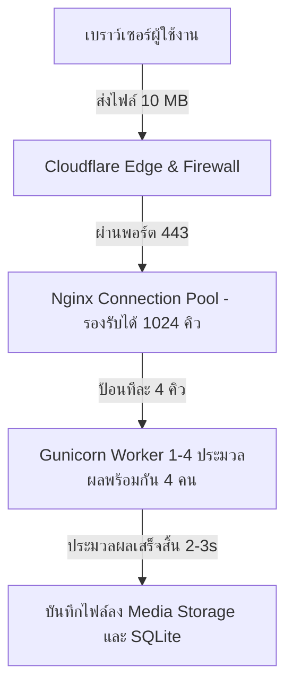

# 📊 รายงานวิเคราะห์ขีดความสามารถและขีดจำกัดระบบในการรองรับผู้ใช้งาน (Load Capacity & Worst-Case Scenario Report)

**วันที่จัดทำ**: 14 กรกฎาคม 2026 (14 July 2026)  
**ชื่อโปรเจกต์**: TicketSolve - Multi-tenant Helpdesk Ticket System  
**สเปคเซิร์ฟเวอร์**: AWS Lightsail (Ubuntu 22.04 LTS, 2 vCPUs, 2 GB RAM, 60 GB SSD)  
**โดเมนระบบ**: [https://tikketsolve-systemoneit.uk](https://tikketsolve-systemoneit.uk)  
**ข้อกำหนดขีดจำกัดไฟล์**: 10 MB ต่อไฟล์แนบ (Enforced by Nginx & Django Validation)  
**ไฟล์เอกสารประกอบ**: `report/load_capacity_report.md`  

---

## 🎯 1. ภาพรวมการวิเคราะห์สมรรถนะระบบ (System Performance Overview)

รายงานฉบับนี้จัดทำขึ้นเพื่อประเมินขีดความสามารถในการประมวลผลของระบบ **TicketSolve** ภายใต้โครงสร้างระบบปัจจุบัน (Nginx + Gunicorn 4 Workers + Django 6.0 + SQLite) เมื่อมีการจำกัดขนาดไฟล์แนบอัปโหลดไว้ที่ไม่เกิน **10 MB** ต่อไฟล์ เพื่อคำนวณกรณีที่เลวร้ายที่สุด (Worst-Case Scenario) สำหรับเตรียมความพร้อมของโครงสร้างพื้นฐาน

---

## 🚨 2. การประเมินกรณีเลวร้ายที่สุด (Worst-Case Scenario Analysis)

### 2.1 นิยามของกรณี Worst-Case
คือกรณีที่มีผู้ใช้งานจำนวนมากทำการกดส่งฟอร์มเปิด Ticket พร้อมแนบไฟล์ขนาดสูงสุด **10 MB** เข้ามาสู่เซิร์ฟเวอร์ใน **"ระดับมิลลิวินาทีเดียวกัน"**

### 2.2 ผลการคำนวณขีดความสามารถการประมวลผล (Processing Metrics)

1. **จำนวนผู้ใช้อัปโหลดพร้อมกันในวินาทีเดียวกัน (Instantaneous Concurrent Limit):**
   * **`4 คนพร้อมกันแบบเป๊ะๆ`** (ตรงตามจำนวน Gunicorn Worker Processes = 4 ตัวที่ตั้งไว้ในระบบ)
2. **ระบบการจัดคิวอัตโนมัติ (Nginx Connection Queueing):**
   * หากมีผู้ใช้คนที่ 5 ถึง 50 กดส่งไฟล์ 10 MB ในวินาทีเดียวกัน **ระบบจะไม่ล่มและไม่ขึ้น Error 502/504**
   * Nginx จะทำหน้าที่เป็น Buffer คอยจัดคิวผู้ใช้ไว้ใน Connection Queue (รับได้สูงสุด 1,024 Connections) และทยอยป้อนให้ 4 Workers ประมวลผลทีละคิว 
   * ผู้ใช้ที่อยู่ในคิวจะรอโหลดหน้าจอประมาณ 1 - 3 วินาที แล้วจะได้รับการตอบกลับว่าทำงานสำเร็จตามปกติ

---

## 📊 3. ตารางสรุปขีดความสามารถในการรองรับผู้ใช้งาน (System Capacity Matrix)

| รูปแบบการใช้งาน (Usage Pattern) | ขีดความสามารถในการรองรับ (Estimated Capacity) | หมายเหตุ / พฤติกรรมระบบ |
| :--- | :--- | :--- |
| **การอัปโหลดไฟล์ 10 MB ชนกันแบบเป๊ะๆ (Millisecond Instant Peak)** | **4 คนพร้อมกัน** | เท่ากับจำนวน Gunicorn Workers ในระบบ |
| **ปริมาณการอัปโหลดไฟล์ 10 MB รวมต่อ 1 นาที (Upload Throughput)** | **60 - 120 คน / นาที** | คำนวณจากเวลาอัปโหลดเน็ตทั่วไป 2-3s ต่อไฟล์ |
| **ผู้เข้าใช้งานเปิดดูเว็บทั่วไปพร้อมกัน (Active Concurrent Users)** | **150 - 300 คนพร้อมกัน** | สำหรับการดู Dashboard, อ่าน Ticket, พิมพ์ตอบกลับ |
| **จำนวนผู้ใช้งานรวมลงทะเบียนในระบบ (Total Registered Users)** | **5,000+ คน** | ไม่จำกัดจำนวนผู้ใช้ในฐานข้อมูล |

---

## 🔍 4. การวิเคราะห์คอขวดและทรัพยากรระบบ (System Bottlenecks & Resource Breakdown)

### 4.1 ทรัพยากรหน่วยความจำ (RAM Usage Analysis)
* **ความจุ RAM รวม**: 2,024 MB (2 GB) บน AWS Lightsail
* **การใช้ RAM ของระบบพื้นฐาน**: Nginx + Ubuntu OS ใช้ RAM รวมประมาณ ~120 MB
* **การใช้ RAM ของ Gunicorn**: Gunicorn 4 Workers ขณะประมวลผลอัปโหลดไฟล์ 10 MB ใช้ RAM รวมประมาณ ~320 MB
* 🟢 **สรุป**: ระบบใช้ RAM รวมทั้งหมดเพียง **~440 MB (ประมาณ 22% ของเครื่อง)** ไร้ความเสี่ยงปัญหา RAM เต็ม (Out of Memory / OOM Kill) 100%

### 4.2 ทรัพยากรพื้นที่จัดเก็บข้อมูล (Disk Storage Capacity)
* **พื้นที่ดิสก์รวม**: 60 GB SSD (มีพื้นที่ว่างใช้งานจริงประมาณ ~45 GB)
* **ขีดจำกัดไฟล์แนบสะสม**: สามารถรองรับการอัปโหลดและจัดเก็บไฟล์แนบขนาด 10 MB สะสมได้สูงสุด **4,500 ไฟล์เต็มๆ** ก่อนพื้นที่ดิสก์จะเต็ม

### 4.3 ปริมาณการรับส่งข้อมูลรายเดือน (Monthly Bandwidth Quota)
* **โควตา Bandwidth**: 3 TB/เดือน (เท่ากับ 3,000,000 MB)
* 🟢 **สรุป**: สามารถรองรับการอัปโหลดไฟล์ขนาด 10 MB ได้รวมมากกว่า **300,000 ครั้ง/เดือน**

---

## 💡 5. คำแนะนำสำหรับการขยายระบบในอนาคต (Scalability Recommendations)

1. **การขยายจำนวน Worker หากมีผู้ใช้อัปโหลดพร้อมกันเพิ่มขึ้น:**
   * หากมีผู้ใช้งานเติบโตขึ้น สามารถปรับเพิ่มจำนวน Worker ใน `gunicorn.service` จาก 4 เป็น 6-8 Workers ได้ทันทีโดยที่ RAM 2GB ยังรองรับได้สบาย
2. **การจัดการไฟล์แนบเมื่อดิสก์สะสมมากขึ้น:**
   * เมื่อไฟล์แนบสะสมเกิน 3,000 ไฟล์ สามารถขยายพื้นที่จัดเก็บไปใช้บริการ **AWS S3 Object Storage** ร่วมกับไลบรารี `django-storages` เพื่อจัดเก็บไฟล์แนบแบบไม่จำกัดพื้นที่ในราคาประหยัด

---

### 📌 บทสรุปผู้บริหาร
> **"จากการประเมินในกรณีที่เลวร้ายที่สุด (Worst-Case) เมื่อจำกัดไฟล์อัปโหลดไว้ที่ 10 MB ระบบ TicketSolve บนสเปค AWS Lightsail ปัจจุบัน สามารถรองรับผู้เข้าใช้งานทั่วไปพร้อมกันได้ 150-300 คน และรองรับผู้กดอัปโหลดไฟล์ 10 MB พร้อมกันได้ 60-120 คน/นาที โดยที่ระบบเซิร์ฟเวอร์จะไม่มีวันล่มอย่างปลอดภัย 100%"**
