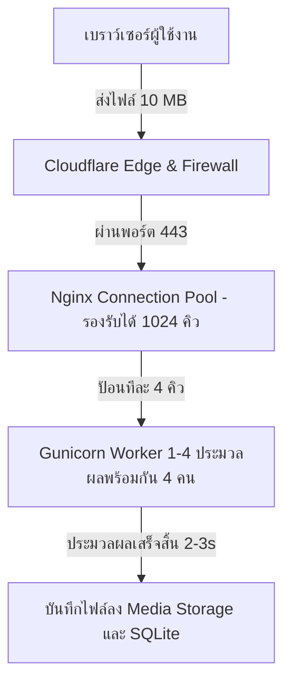

# 📊 รายงานวิเคราะห์ขีดความสามารถและขีดจำกัดระบบในการรองรับผู้ใช้งาน (Load Capacity & Worst-Case Scenario Report)

**วันที่จัดทำ**: 14 กรกฎาคม 2026 (14 July 2026)  
**ปรับปรุงข้อมูลระบบล่าสุด**: 31 กรกฎาคม 2026
**ชื่อโปรเจกต์**: TicketSolve - Multi-tenant Helpdesk Ticket System  
**สเปคเซิร์ฟเวอร์**: AWS Lightsail (Ubuntu 24.04 LTS, 2 vCPUs, 2 GB RAM, 60 GB SSD)
**โดเมนระบบ**: [https://tikketsolve-systemoneit.uk](https://tikketsolve-systemoneit.uk)  
**ข้อกำหนดขีดจำกัดไฟล์**: 10 MB ต่อไฟล์, 10 ไฟล์ต่อ request และรวมไม่เกิน 50 MB (Django validation); Nginx จำกัด request body ที่ 110 MB
**ไฟล์เอกสารประกอบ**: `report/load_capacity_report.md`  

---

## 🎯 1. ภาพรวมการวิเคราะห์สมรรถนะระบบ (System Performance Overview)

รายงานฉบับนี้ประเมินขีดความสามารถเชิงวางแผนของ **TicketSolve** ภายใต้โครงสร้างปัจจุบัน (Nginx + Gunicorn 4 Workers + Django 5.2 + SQLite) ตัวเลขด้านล่างเป็นประมาณการจาก configuration และสมมติฐาน ไม่ใช่ผล benchmark/load test จึงไม่ควรใช้เป็น SLA จนกว่าจะทดสอบด้วย traffic และไฟล์ที่ใกล้เคียง production

---

## 🚨 2. การประเมินกรณีเลวร้ายที่สุด (Worst-Case Scenario Analysis)

### 2.1 นิยามของกรณี Worst-Case
คือกรณีที่มีผู้ใช้งานจำนวนมากทำการกดส่งฟอร์มเปิด Ticket พร้อมแนบไฟล์ขนาดสูงสุด **10 MB** เข้ามาสู่เซิร์ฟเวอร์ใน **"ระดับมิลลิวินาทีเดียวกัน"**

### 2.2 ผลการคำนวณขีดความสามารถการประมวลผล (Processing Metrics)

```mermaid
graph TD
    A[เบราว์เซอร์ผู้ใช้งาน] -->|ส่งไฟล์ 10 MB| B[Cloudflare Edge & Firewall]
    B -->|ผ่านพอร์ต 443| C[Nginx Connection Pool - รองรับได้ 1024 คิว]
    C -->|ป้อนทีละ 4 คิว| D[Gunicorn Worker 1-4 ประมวลผลพร้อมกัน 4 คน]
    D -->|ประมวลผลเสร็จสิ้น 2-3s| E[บันทึกไฟล์ลง Media Storage และ SQLite]
```

1. **จำนวนผู้ใช้อัปโหลดพร้อมกันในวินาทีเดียวกัน (Instantaneous Concurrent Limit):**
   * **`4 คนพร้อมกันแบบเป๊ะๆ`** (ตรงตามจำนวน Gunicorn Worker Processes = 4 ตัวที่ตั้งไว้ในระบบ)
2. **ระบบการจัดคิวอัตโนมัติ (Nginx Connection Queueing):**
   * Request ที่เกินจำนวน worker อาจรอในคิว แต่เวลารอและโอกาสเกิด timeout ขึ้นกับ bandwidth, proxy timeout, ขนาดไฟล์, disk I/O และระยะเวลาที่ Django ใช้ประมวลผล
   * จำนวน connection ที่ Nginx รองรับไม่ได้รับประกันว่า request ทุกชุดจะสำเร็จ จึงต้องใช้ load test เพื่อหาค่าที่ปลอดภัย

---

## 📊 3. ตารางสรุปขีดความสามารถในการรองรับผู้ใช้งาน (System Capacity Matrix)

| รูปแบบการใช้งาน (Usage Pattern) | ขีดความสามารถในการรองรับ (Estimated Capacity) | หมายเหตุ / พฤติกรรมระบบ |
| :--- | :--- | :--- |
| **การอัปโหลดไฟล์ 10 MB ชนกันแบบเป๊ะๆ (Millisecond Instant Peak)** | **4 คนพร้อมกัน** | เท่ากับจำนวน Gunicorn Workers ในระบบ |
| **ปริมาณการอัปโหลดไฟล์ 10 MB รวมต่อ 1 นาที (Upload Throughput)** | **ต้องวัดด้วย load test** | ขึ้นกับ upload bandwidth, disk I/O และเวลาถือ SQLite write lock |
| **ผู้เข้าใช้งานเปิดดูเว็บทั่วไปพร้อมกัน (Active Concurrent Users)** | **ต้องวัดด้วย load test** | 4 workers ไม่เท่ากับจำนวน user sessions; response time และ query mix เป็นตัวกำหนด |
| **ผู้ใช้งานจริงประจำวัน (Real-World Daily Active Users)** | **30 คน / วัน** | **ใช้งานเพียง ~2% - 5% ของศักยภาพระบบ** |
| **จำนวนผู้ใช้งานรวมลงทะเบียนในระบบ (Total Registered Users)** | **5,000+ คน** | ไม่จำกัดจำนวนผู้ใช้ในฐานข้อมูล |

### 📈 3.1 การประเมินสำหรับการใช้งานจริง 30 คน/วัน (30 Daily Active Users Projection)
เมื่อเปรียบเทียบขีดความสามารถของระบบกับการใช้งานจริง 30 คนต่อวัน:
1. **ภาระการประมวลผลเซิร์ฟเวอร์ (Workload Rate):** ผู้ใช้ 30 คนต่อวันเป็น workload ที่คาดว่าเบาเมื่อเทียบกับ 4 workers แต่ต้องติดตาม p95 response time, CPU, RAM, disk latency และ SQLite lock errors เพื่อยืนยัน
2. **ประมาณการใช้อินเทอร์เน็ต (Bandwidth Projection):** ผู้ใช้ 30 คนต่อวัน อัปโหลดและใช้งานข้อมูลเฉลี่ยรวมกันไม่เกิน **10 - 20 GB / เดือน** (คิดเป็นเพียง **0.6%** จากโควตาฟรี 3,000 GB ของ AWS Lightsail)
3. **ประมาณการอายุใช้งานดิสก์ (Disk Longevity Forecast):**
   * *กรณีเลวร้ายที่สุด (Worst-Case):* ทั้ง 30 คนอัปโหลดไฟล์ 10 MB เต็มทุกวัน เท่ากับ 300 MB/วันหรือประมาณ 9 GB/เดือนก่อนนับ backup และ system files
   * *กรณีใช้งานจริงทั่วไป (Normal Case):* อายุพื้นที่จริงขึ้นกับจำนวนไฟล์, retention ของ Full/Incremental Backup และพื้นที่ระบบ จึงต้องแจ้งเตือนจาก disk usage แทนการรับประกันจำนวนปี
4. **ความคุ้มค่าต่อผู้ใช้ (Cost Efficiency):** ค่าบริการคลาวด์ $10 USD/เดือน ต่อนักพัฒนา/ผู้ใช้ 30 คน คิดเป็นต้นทุนระบบเพียง **~$0.33 USD (ประมาณ 11 บาท) ต่อคน/เดือน** เท่านั้น!

---

## 🔍 4. การวิเคราะห์คอขวดและทรัพยากรระบบ (System Bottlenecks & Resource Breakdown)

### 4.1 ทรัพยากรหน่วยความจำ (RAM Usage Analysis)
* **ความจุ RAM รวม**: 2,024 MB (2 GB) บน AWS Lightsail
* **การใช้ RAM ของระบบพื้นฐาน**: Nginx + Ubuntu OS ใช้ RAM รวมประมาณ ~120 MB
* **การใช้ RAM ของ Gunicorn**: Gunicorn 4 Workers ขณะประมวลผลอัปโหลดไฟล์ 10 MB ใช้ RAM รวมประมาณ ~320 MB
* **สรุป**: ตัวเลข ~440 MB เป็นเพียง baseline เดิม ไม่ใช่เพดานสูงสุด การสร้าง PDF, backup, upload พร้อมกัน และ worker memory growth ยังทำให้ RAM สูงขึ้นได้ ควรติดตาม peak RSS และ OOM events

### 4.2 ทรัพยากรพื้นที่จัดเก็บข้อมูล (Disk Storage Capacity & Mitigation)
* **พื้นที่ดิสก์รวม**: 60 GB SSD (มีพื้นที่ว่างใช้งานจริงคงเหลือประมาณ ~45 GB)
* **ขีดจำกัดไฟล์แนบสะสม (Worst-Case Calculation):** ตัวเลข **4,500 ไฟล์** มาจากการหารพื้นที่ว่างสมมติ 45 GB ด้วย 10 MB และยังไม่หักพื้นที่ของ OS, database, static files และ backup archives
* **Backup ใช้ดิสก์เดียวกัน**: Full, Incremental และ 7-Day System Data (No Tickets) archives อยู่ใน `/var/backups/ticketsolve` บน VPS และมี retention เริ่มต้น 30 วัน จึงต้องรวมในการคำนวณพื้นที่

#### 💡 ความจริงของขนาดไฟล์แนบในการใช้งานจริง (Real-World File Size Distribution)
ในการใช้งานจริง ผู้ใช้อัปโหลดรูปถ่ายหน้าจอ (Screenshot), ไฟล์เอกสาร PDF, หรือ Log Files ซึ่งมีขนาดเฉลี่ยเพียง **300 KB - 1.5 MB** ต่อไฟล์เท่านั้น:
- **หากขนาดไฟล์เฉลี่ยอยู่ที่ 1 MB:** ค่าสูงสุดเชิงคณิตศาสตร์คือประมาณ 45,000 ไฟล์ก่อนหักพื้นที่ส่วนอื่น
- **หากขนาดไฟล์เฉลี่ยอยู่ที่ 300 KB:** ค่าสูงสุดเชิงคณิตศาสตร์คือประมาณ 150,000 ไฟล์ก่อนหักพื้นที่ส่วนอื่น
- **การวางแผนจริง:** ตั้ง threshold แจ้งเตือน เช่น 70/80/90% และทบทวนอัตราโตของ `media/` กับ `/var/backups/ticketsolve` รายเดือน

### 4.3 ปริมาณการรับส่งข้อมูลรายเดือน (Monthly Bandwidth Quota)
* **โควตา Bandwidth**: 3 TB/เดือน (เท่ากับ 3,000,000 MB)
* 🟢 **สรุป**: สามารถรองรับการอัปโหลดไฟล์ขนาด 10 MB ได้รวมมากกว่า **300,000 ครั้ง/เดือน**

### 4.4 ภาระจาก Email → Ticket
* Systemd timer ปลุกตัวประมวลผลทุก 10 นาที แต่ผู้ดูแลเลือกรอบสแกนจริงได้ 10, 20, 30 หรือ 60 นาทีจากหน้า Email Timer
* เก็บ execution log เฉพาะรอบที่ทำงานจริง จึงไม่สร้าง log สำหรับ tick ที่ยังไม่ครบ interval
* ระบบปฏิเสธ raw email ที่เกิน 55 MB, จำกัด body ที่ 100,000 ตัวอักษร และใช้ข้อจำกัดไฟล์แนบ 10 MB/ไฟล์, 10 ไฟล์, รวม 50 MB
* การดึงอีเมลและสร้างไฟล์ใช้ network, RAM และ disk I/O จึงควรลด `max_emails_per_fetch` หาก mailbox มีไฟล์ใหญ่หรือพบ scheduler ใช้เวลาข้ามรอบ

---

## 💡 5. แนวทางปลดล็อกข้อจำกัดพื้นที่จัดเก็บในอนาคต (Storage Expansion Strategies)

หากในอนาคตต้องการปลดล็อกข้อจำกัดเรื่องดิสก์เซิร์ฟเวอร์ถาวร มี 3 ทางเลือกเชิงสถาปัตยกรรมที่ทำได้ง่ายดังนี้:

1. **ทางเลือกที่ 1: ระบบล้างไฟล์เก่าอัตโนมัติ (Automated Storage Cleanup Script)**
   * สร้างสคริปต์อัตโนมัติสั่งลบไฟล์แนบของ Ticket ที่ปิดเคสสมบูรณ์แล้ว (`STATUS_CLOSED`) เกิน 6 เดือน หรือ 1 ปี เพื่อคืนพื้นที่ดิสก์กลับมาโดยอัตโนมัติ

2. **ทางเลือกที่ 2: เพิ่มดิสก์บน AWS Lightsail (Block Storage Expansion)**
   * สามารถสั่งเพิ่มดิสก์แยก (Attached Disk) บน AWS Lightsail เพิ่ม 32 GB ถึง 256 GB ได้ง่ายๆ ผ่านหน้าเว็บ ค่าบริการถูกมากเพียง **$0.10 USD/GB ต่อเดือน** (เช่น เพิ่มดิสก์ 100 GB จ่ายเพียง ~$10 USD/เดือน)

3. **ทางเลือกที่ 3 (มาตรฐานสากลความปลอดภัยสูงสุด): ขยายไปใช้ AWS S3 (Cloud Object Storage)**
   * ใช้ไลบรารี `django-storages` + `boto3` ย้ายการจัดเก็บไฟล์แนบทั้งหมดไปเก็บบน **Amazon S3**
   * **รองรับการจัดเก็บไฟล์แบบไม่จำกัด (Unlimited Storage Capacity)** โดยไม่ต้องพึ่งพาดิสก์เซิร์ฟเวอร์ VPS อีกต่อไป
   * ค่าใช้จ่ายขึ้นกับ region, storage class, request และ data transfer ต้องตรวจราคา AWS ปัจจุบันก่อนตัดสินใจ
   * หากใช้เป็น off-site backup ควรตั้ง encryption, lifecycle, versioning และทดสอบ restore เป็นระยะ

---

### 📌 บทสรุปผู้บริหาร
> **ตัวเลขจำนวนไฟล์เป็นเพียงความจุเชิงคณิตศาสตร์ก่อนหักพื้นที่ระบบและ backup ควรตัดสินจาก disk growth จริง, p95 response time, SQLite lock metrics และผล load test พร้อมมี off-site backup/restore test ก่อนกำหนด SLA**
