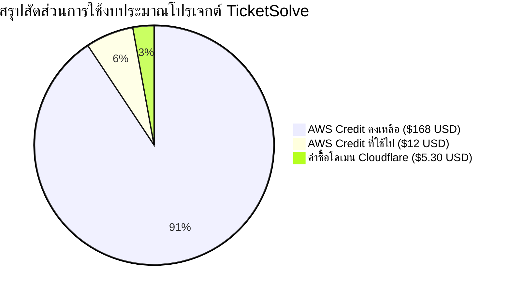

# 📊 รายงานสรุปรายละเอียดโปรเจกต์ TicketSolve (Project Summary Report)

**วันที่จัดทำ**: 14 กรกฎาคม 2026 (14 July 2026)  
**ชื่อโปรเจกต์**: TicketSolve - Multi-tenant Helpdesk Ticket System  
**ผู้พัฒนา**: SOI-NARUNAI / SystemOne IT Team  
**โดเมนระบบจริง**: [https://tikketsolve-systemoneit.uk](https://tikketsolve-systemoneit.uk)  
**ไอพีเซิร์ฟเวอร์ (Static IP)**: `3.1.52.201`  

---

## 🛠️ 1. เทคโนโลยีที่ใช้ในโปรเจกต์ (Tech Stack Architecture)

| ส่วนประกอบ (Layer) | เทคโนโลยีที่เลือกใช้ (Technology Stack) | รายละเอียดและหน้าที่การทำงาน |
| :--- | :--- | :--- |
| **Backend Framework** | **Python 3.12 / Django 6.0** | ใช้เป็น Core Engine หลักในการจัดการตรรกะระบบ (Business Logic), ORM ฐานข้อมูล, และระบบสิทธิ์ความปลอดภัย |
| **Database** | **SQLite 3 / PostgreSQL Ready** | ฐานข้อมูลความเร็วสูง จัดเก็บข้อมูลตั๋วปัญหา, บัญชีผู้ใช้, บริษัท, และ Audit Logs |
| **Frontend UI/UX** | **HTML5, Vanilla JS, CSS3, Tailwind CSS** | พัฒนาด้วยเทคโนโลยี Modern Responsive Web Design สไตล์ Glassmorphic UI รองรับทุกขนาดหน้าจอ |
| **PDF Generation Engine**| **`xhtml2pdf` + Sarabun & Tahoma Font** | ไลบรารีแปลงโครงสร้าง HTML/CSS เป็นไฟล์ PDF รายงานประจำเดือน รองรับการแสดงผลอักขระภาษาไทย 100% |
| **Web Server & WSGI** | **Nginx + Gunicorn** | Nginx ทำหน้าที่เป็น Reverse Proxy จัดการ SSL และไฟล์ Static/Media ส่วน Gunicorn รับหน้าที่เป็น WSGI HTTP Application Server |
| **Domain & DNS Management**| **Cloudflare DNS & Proxy** | จัดการเส้นทางโดเมน SSL/TLS, CNAME, A Record พร้อมระบบการป้องกัน DDOS และ Cloudflare Edge Acceleration |
| **SSL/TLS Security** | **Let's Encrypt (Certbot)** | ออกใบรับรองความปลอดภัย HTTPS แบบเข้ารหัสความปลอดภัยระดับสากลแบบอัตโนมัติ |
| **Cloud Infrastructure** | **AWS Lightsail (Ubuntu 22.04 LTS)** | คลาวด์ VPS ประสิทธิภาพสูง ตั้งอยู่ในภูมิภาค Singapore (ap-southeast-1a) เพื่อความเร็วตอบสนองในไทยสูงสุด |

---

## ⚡ 2. รายงานฟังก์ชันและคุณสมบัติทั้งหมดในระบบ (Complete Feature Catalog)

### 🏢 1. ระบบแยกข้อมูลองค์กรและพนักงาน (Multi-tenant Data Isolation)
- **Data Isolation**: ปิดกั้นการมองเห็นและการดึงข้อมูลตั๋วปัญหาระหว่างบริษัทลูกค้าอย่างสมบูรณ์แบบ
- **Scope Lockdown**: ระบบตรวจสอบสิทธิ์ในระดับ View การยิง URL ข้ามบริษัทจะถูกปฏิเสธด้วยสถานะ `403 Forbidden` ทันที

### 👥 2. ระบบสิทธิ์ผู้ใช้งาน (Role-Based Access Control - RBAC)
- **System Administrator**: สิทธิ์ระดับสูงสุด ดูแลทุกบริษัท ตั้งค่าเซิร์ฟเวอร์ SMTP ส่วนกลาง ออกรายงาน PDF และจัดการบัญชีผู้ใช้
- **System Sub-Administrator**: ช่วย System Admin จัดการเคสและตั๋วปัญหา แต่ไม่มีสิทธิ์ปรับแต่งการตั้งค่า SMTP หรือเปลี่ยนสิทธิ์ Admin คนอื่น
- **Client Administrator**: ดูแลตั๋วและผู้ใช้เฉพาะภายในบริษัทตนเอง ดูสถิติ และสั่งส่งรายงาน PDF ประจำเดือนของบริษัทตนเองได้
- **Client User**: แจ้งตั๋วปัญหาใหม่ ติดตามความคืบหน้า และคอมเมนต์โต้ตอบเฉพาะตั๋วของตนเอง

### 🎫 3. ระบบวงจรชีวิตของตั๋วแจ้งปัญหา (Ticket Lifecycle Management)
- **สร้างตั๋วใหม่ (Ticket Creation)**: ระบุชื่อเรื่อง รายละเอียด ระดับความสำคัญ และแนบไฟล์เอกสาร/รูปภาพ
- **หมวดหมู่ปัญหา 5 ประเภท (Categories)**:
  1. `Hardware` (อุปกรณ์คอมพิวเตอร์ / พริ้นเตอร์ / ฮาร์ดแวร์)
  2. `Software` (โปรแกรม / ระบบปฏิบัติการ)
  3. `Network / Internet` (อินเทอร์เน็ต / สัญญาณเครือข่าย)
  4. `Account / Login` (บัญชีผู้ใช้ / รหัสผ่าน)
  5. `Other` (อื่นๆ)
- **ติดตามและอัปเดตงาน**: ปรับเปลี่ยนสถานะงาน (`Open`, `In Progress`, `Resolved`, `Closed`) และระดับความสำคัญ (`Low`, `Medium`, `High`, `Urgent`)
- **การตอบกลับโต้ตอบ (Interactive Comments)**: ระบบแชตคอมเมนต์โต้ตอบระหว่างผู้แจ้งและช่างเทคนิคผู้ดูแล

### 📄 4. ระบบออกรายงาน PDF ประจำเดือน (Monthly PDF Report & Dispatcher)
- **HTML-to-PDF Report**: ประมวลผลและสร้างรายงานสรุปสถิติตั๋วประจำเดือน แปลงเป็นไฟล์ PDF ดีไซน์สวยงาม
- **Thai Font Encoding Fixed**: รองรับฟอนต์ไทย Sarabun / Tahoma อย่างสมบูรณ์ ไม่มีปัญหาตัวอักษรสี่เหลี่ยมหรืออักขระต่างดาว
- **Instant PDF Preview & Email Dispatch**: สามารถเปิดดูตัวอย่างไฟล์ PDF บนเบราว์เซอร์ และกดส่งอีเมลหาพนักงานหรือผู้บริหารในองค์กรได้ทันที
- **Active Mailer Selection**: เลือกได้ว่าต้องการยิงส่งไฟล์รายงานผ่านคอนฟิกบัญชี SMTP ตัวใด

### ✉️ 5. ระบบจัดการเซิร์ฟเวอร์ส่งอีเมล (Dynamic SMTP Management)
- **Web UI Management**: แอดมินสามารถเพิ่ม ลบ หรือแก้ไขข้อมูลเชื่อมต่อ SMTP ได้บนเว็บแอปพลิเคชันโดยตรง
- **Provider Presets**: มีปุ่มพรีเซ็ตกรอกค่าอัตโนมัติสำหรับ Google Gmail, Microsoft Outlook, และ Simulation Test
- **App Password Guide**: มีหน้าต่างคู่มือแนะนำวิธีขอรหัส App Password 16 หลักจาก Google และ Microsoft แบบละเอียด

### 🎨 6. การปรับแต่ง UI/UX & ความปลอดภัย (Design & Usability)
- **Bilingual Support (TH/EN)**: ระบบเปลี่ยนภาษาไทย-อังกฤษ สลับใช้งานได้ทันทีทั่วทั้งระบบผ่าน Header Switcher
- **Modern Glassmorphic Design System**: ดีไซน์ล้ำสมัยพร้อมรองรับ **Dark Mode** และ **Light Mode**
- **Color Accent Customizer**: ปรับเปลี่ยนโทนสีเน้นของระบบได้ 5 โทนสี (`Indigo`, `Emerald`, `Rose`, `Blue`, `Violet`)
- **Audit Logs Trail**: เก็บบันทึกประวัติการเปลี่ยนสถานะตั๋ว, ประวัติการอ่าน PDF และประวัติการจัดส่งอีเมลย้อนหลัง

---

## 💰 3. รายละเอียดการ Deploy และงบประมาณ (Deployment & Budget Summary)

### ☁️ 1. ข้อมูลโครงสร้างเซิร์ฟเวอร์บน AWS Lightsail
- **AWS Region**: Singapore, Zone A (`ap-southeast-1a`)
- **Instance Blueprint**: Ubuntu 22.04 LTS (64-bit)
- **Hardware Specs**: 2 vCPUs, 2 GB RAM, 60 GB SSD Storage (โอนถ่ายข้อมูล 3 TB/Month)
- **Networking**: Dedicated Static IPv4 (`3.1.52.201`) + Dual-stack IPv6
- **Security Group / Firewall**: เปิดพอร์ต SSH (`22`), HTTP (`80`), และ HTTPS (`443`)

### 💵 2. รายงานสรุปค่าใช้จ่ายและงบประมาณ (Budget Execution)

| รายการ (Expense Item) | รายละเอียด (Details) | มูลค่า/งบประมาณ (Amount) | สถานะ (Status) |
| :--- | :--- | :--- | :--- |
| **AWS Lightsail Free Trial Credit** | เครดิตฟรีสำหรับทดลองใช้งานคลาวด์ AWS (จากงบรวม $180 USD) | **ใช้ไป $12.00 USD** | 🟢 ใช้งานเครดิตฟรี (คงเหลือ $168 USD) |
| **Cloudflare Domain Registration** | ค่าจดทะเบียนโดเมนเนม `tikketsolve-systemoneit.uk` ผ่าน Cloudflare Registrar | **$5.30 USD** | 🟢 ชำระเงินเรียบร้อยแล้ว |
| **SSL Certificate (Let's Encrypt)** | ใบรับรองความปลอดภัย HTTPS เข้ารหัสเว็บแบบวิกฤตความปลอดภัยสูง | **$0.00 USD (FREE)** | 🟢 ติดตั้งใช้งานฟรีถาวร |
| **รวมรายจ่ายสุทธิ (Total Out-of-Pocket Expense)** | ค่าใช้จ่ายเงินจริงในการจัดทำโปรเจกต์นี้ทั้งหมด | **$5.30 USD** *(ประมาณ ~190 บาท)* | ✅ ประหยัดงบประมาณสูงสุด |

---

### 📌 สรุปสถานะโปรเจกต์ ณ ปัจจุบัน
โปรเจกต์ **TicketSolve** ได้ทำการ Deploy ขึ้นระบบจริงบน **AWS Lightsail** ร่วมกับโดเมน **`https://tikketsolve-systemoneit.uk`** สำเร็จ 100% พร้อมใช้งานสำหรับงานสนับสนุนด้านไอทีจริงเรียบร้อยแล้ว! 🚀
