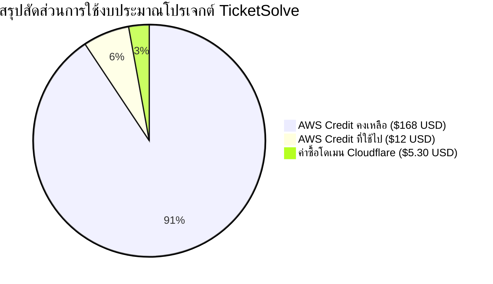

# 📊 รายงานสรุปรายละเอียดโปรเจกต์ TicketSolve (Project Summary Report)

**วันที่จัดทำ**: 14 กรกฎาคม 2026 (14 July 2026)  
**ปรับปรุงข้อมูลระบบล่าสุด**: 31 กรกฎาคม 2026
**ชื่อโปรเจกต์**: TicketSolve - Multi-tenant Helpdesk Ticket System  
**ผู้พัฒนา**: SOI-NARUNAI / SystemOne IT Team  
**โดเมนระบบจริง**: [https://tikketsolve-systemoneit.uk](https://tikketsolve-systemoneit.uk)  
**ไอพีเซิร์ฟเวอร์ (Static IP)**: `3.1.52.201`  

---

## 🛠️ 1. เทคโนโลยีที่ใช้ในโปรเจกต์ (Tech Stack Architecture)

| ส่วนประกอบ (Layer) | เทคโนโลยีที่เลือกใช้ (Technology Stack) | รายละเอียดและหน้าที่การทำงาน |
| :--- | :--- | :--- |
| **Backend Framework** | **Python 3.12 / Django 5.2** | ใช้เป็น Core Engine หลักในการจัดการตรรกะระบบ (Business Logic), ORM ฐานข้อมูล, และระบบสิทธิ์ความปลอดภัย |
| **Database** | **SQLite 3 (Production ปัจจุบัน)** | จัดเก็บข้อมูล Ticket, บัญชีผู้ใช้, บริษัท และ Audit Logs; การย้ายไป PostgreSQL ต้องตั้งค่าและทดสอบ migration เพิ่มเติม |
| **Frontend UI/UX** | **HTML5, Vanilla JS, CSS3, Tailwind CSS** | พัฒนาด้วยเทคโนโลยี Modern Responsive Web Design สไตล์ Glassmorphic UI รองรับทุกขนาดหน้าจอ |
| **PDF Generation Engine**| **`xhtml2pdf` + Sarabun & Tahoma Font** | ไลบรารีแปลงโครงสร้าง HTML/CSS เป็นไฟล์ PDF รายงานประจำเดือน รองรับการแสดงผลอักขระภาษาไทย 100% |
| **Web Server & WSGI** | **Nginx + Gunicorn** | Nginx ทำหน้าที่เป็น Reverse Proxy, TLS และ Static files; `/media/` โดยตรงถูกปิด ส่วนไฟล์แนบส่งผ่าน Django หลังตรวจสิทธิ์ |
| **Domain & DNS Management**| **Cloudflare DNS & Proxy** | จัดการเส้นทางโดเมน SSL/TLS, CNAME, A Record พร้อมระบบการป้องกัน DDOS และ Cloudflare Edge Acceleration |
| **SSL/TLS Security** | **Let's Encrypt (Certbot)** | ออกใบรับรองความปลอดภัย HTTPS แบบเข้ารหัสความปลอดภัยระดับสากลแบบอัตโนมัติ |
| **Cloud Infrastructure** | **AWS Lightsail (Ubuntu 24.04 LTS)** | VPS ตั้งอยู่ในภูมิภาค Singapore (`ap-southeast-1`) |

---

## ⚡ 2. รายงานฟังก์ชันและคุณสมบัติทั้งหมดในระบบ (Complete Feature Catalog)

### 🏢 1. ระบบแยกข้อมูลองค์กรและพนักงาน (Multi-tenant Data Isolation)
- **Data Isolation**: ใช้ฟังก์ชันกำหนดขอบเขตส่วนกลางใน `tickets/permissions.py` เพื่อลดความเสี่ยงที่แต่ละ View ใช้เงื่อนไขไม่เหมือนกัน
- **Scope Lockdown**: System Staff เห็นทุก tenant, Client Admin/Staff เห็น company tree ของตน และ Client User เห็นเฉพาะ Ticket ที่ตนสร้าง การเปิด Ticket ข้ามขอบเขตถูกปฏิเสธ ส่วนไฟล์แนบที่มองไม่เห็นตอบ `404`

### 👥 2. ระบบสิทธิ์ผู้ใช้งาน (Role-Based Access Control - RBAC)
- **System Administrator**: สิทธิ์ระดับสูงสุด ดูแลทุกบริษัท ตั้งค่าเซิร์ฟเวอร์ SMTP ส่วนกลาง ออกรายงาน PDF และจัดการบัญชีผู้ใช้
- **System Sub-Administrator**: ช่วย System Admin จัดการเคสและตั๋วปัญหา แต่ไม่มีสิทธิ์ปรับแต่งการตั้งค่า SMTP หรือเปลี่ยนสิทธิ์ Admin คนอื่น
- **Client Administrator**: ดูแลตั๋วและผู้ใช้เฉพาะภายในบริษัทตนเอง ดูสถิติ และสั่งส่งรายงาน PDF ประจำเดือนของบริษัทตนเองได้
- **Client Staff**: อ่านและแก้ไข Ticket ภายใน company tree, เปลี่ยนสถานะ, แสดงความคิดเห็น และยืนยัน deployment
- **Client User**: แจ้งตั๋วปัญหาใหม่ ติดตามความคืบหน้า และคอมเมนต์โต้ตอบเฉพาะตั๋วของตนเอง
- **Superuser Protection**: ผู้ดูแลระดับแอปที่ไม่ใช่ Django superuser ไม่สามารถเปิดหรือแก้ไขบัญชี Django superuser

### 🎫 3. ระบบวงจรชีวิตของตั๋วแจ้งปัญหา (Ticket Lifecycle Management)
- **สร้างตั๋วใหม่ (Ticket Creation)**: ระบุชื่อเรื่อง รายละเอียด ระดับความสำคัญ และแนบไฟล์เอกสาร/รูปภาพ
- **หมวดหมู่ปัญหา 5 ประเภท (Categories)**:
  1. `Hardware` (อุปกรณ์คอมพิวเตอร์ / พริ้นเตอร์ / ฮาร์ดแวร์)
  2. `Software` (โปรแกรม / ระบบปฏิบัติการ)
  3. `Network / Internet` (อินเทอร์เน็ต / สัญญาณเครือข่าย)
  4. `Account / Login` (บัญชีผู้ใช้ / รหัสผ่าน)
  5. `Other` (อื่นๆ)
- **ติดตามและอัปเดตงาน**: ปรับเปลี่ยนสถานะงาน (`Open`, `In Progress`, `Resolved`, `Closed`) และระดับความสำคัญ (`Low`, `Medium`, `High`, `Urgent`)
- **การตอบกลับโต้ตอบ (Interactive Comments)**: ระบบแชตคอมเมนต์โต้ตอบระหว่างผู้แจ้งและช่างเทคนิคผู้ดูแล
- **Authenticated Attachments**: จำกัด 10 MB ต่อไฟล์, 10 ไฟล์ต่อ request และรวม 50 MB; ดาวน์โหลดได้เฉพาะผู้ที่มีสิทธิ์เห็น Ticket

### 📄 4. ระบบออกรายงาน PDF ประจำเดือน (Monthly PDF Report & Dispatcher)
- **HTML-to-PDF Report**: ประมวลผลและสร้างรายงานสรุปสถิติตั๋วประจำเดือน แปลงเป็นไฟล์ PDF ดีไซน์สวยงาม
- **Thai Font Encoding Fixed**: รองรับฟอนต์ไทย Sarabun / Tahoma อย่างสมบูรณ์ ไม่มีปัญหาตัวอักษรสี่เหลี่ยมหรืออักขระต่างดาว
- **Instant PDF Preview & Email Dispatch**: สามารถเปิดดูตัวอย่างไฟล์ PDF บนเบราว์เซอร์ และกดส่งอีเมลหาพนักงานหรือผู้บริหารในองค์กรได้ทันที
- **Active Mailer Selection**: เลือกได้ว่าต้องการยิงส่งไฟล์รายงานผ่านคอนฟิกบัญชี SMTP ตัวใด

### ✉️ 5. ระบบจัดการเซิร์ฟเวอร์ส่งอีเมล (Dynamic SMTP Management)
- **Web UI Management**: แอดมินสามารถเพิ่ม ลบ หรือแก้ไขข้อมูลเชื่อมต่อ SMTP ได้บนเว็บแอปพลิเคชันโดยตรง
- **Provider Presets**: มีปุ่มพรีเซ็ตกรอกค่าอัตโนมัติสำหรับ Google Gmail, Microsoft Outlook, และ Simulation Test
- **App Password Guide**: มีหน้าต่างคู่มือแนะนำวิธีขอรหัส App Password 16 หลักจาก Google และ Microsoft แบบละเอียด
- **Feature Routing**: แยกบัญชีที่ใช้ส่ง system email กับบัญชีที่ใช้รับ Email → Ticket หรือเลือกใช้บัญชีเดียวกันทั้งสองฟังก์ชัน
- **Email → Ticket**: อ่าน unread mail ผ่าน IMAP SSL, กรอง subject, สร้าง Ticket/ไฟล์แนบ และป้องกัน Message-ID ซ้ำ
- **Configurable Email Timer**: มีหน้าแยกสำหรับเลือกรอบ 10/20/30/60 นาที, สั่ง Scan now และดู execution log 50 รอบล่าสุด

### 🎨 6. การปรับแต่ง UI/UX & ความปลอดภัย (Design & Usability)
- **Bilingual Support (TH/EN)**: ระบบเปลี่ยนภาษาไทย-อังกฤษ สลับใช้งานได้ทันทีทั่วทั้งระบบผ่าน Header Switcher
- **Modern Glassmorphic Design System**: ดีไซน์ล้ำสมัยพร้อมรองรับ **Dark Mode** และ **Light Mode**
- **Color Accent Customizer**: ปรับเปลี่ยนโทนสีเน้นของระบบได้ 5 โทนสี (`Indigo`, `Emerald`, `Rose`, `Blue`, `Violet`)
- **Audit Logs Trail**: เก็บบันทึกประวัติการเปลี่ยนสถานะตั๋ว, ประวัติการอ่าน PDF และประวัติการจัดส่งอีเมลย้อนหลัง
- **Production Secrets**: เก็บค่าจริงใน `/etc/ticketsolve/ticketsolve.env` permission `0640` และหมุน `SECRET_KEY` อัตโนมัติหากพบค่าที่อ่อน
- **Transport Security**: บังคับ HTTPS, secure cookies, HSTS, `nosniff` และปิด public `/media/`

### 💾 7. ระบบสำรองข้อมูลบน AWS VPS
- **Incremental Backup**: เก็บ Ticket ที่สร้าง/แก้ไขหรือมี comment/ไฟล์แนบใหม่ย้อนหลัง 2 ชั่วโมง
- **Full Backup**: ใช้ SQLite Online Backup API และรวม `media/` โดยไม่รวม secrets
- **Storage & Retention**: เก็บ archive ที่ `/var/backups/ticketsolve` และลบไฟล์เก่าตามค่า retention เริ่มต้น 30 วัน
- **Management UI**: System Staff ดาวน์โหลดหรือลบ archive ได้ และลบ record ที่ไม่มีข้อมูล/ไม่มีไฟล์ได้ด้วย **Delete empty record**
- **ข้อจำกัด**: เป็น backup บน VPS เครื่องเดียว ไม่ใช่ off-site backup

---

## 💰 3. รายละเอียดการ Deploy และงบประมาณ (Deployment & Budget Summary)

### ☁️ 1. ข้อมูลโครงสร้างเซิร์ฟเวอร์บน AWS Lightsail
- **AWS Region**: Singapore, Zone A (`ap-southeast-1a`)
- **Instance Blueprint**: Ubuntu 24.04 LTS (64-bit)
- **Hardware Specs**: 2 vCPUs, 2 GB RAM, 60 GB SSD Storage (โอนถ่ายข้อมูล 3 TB/Month)
- **Networking**: Dedicated Static IPv4 (`3.1.52.201`) + Dual-stack IPv6
- **Security Group / Firewall**: เปิดพอร์ต SSH (`22`), HTTP (`80`), และ HTTPS (`443`)

### 💵 2. รายงานสรุปค่าใช้จ่ายและงบประมาณ (Budget Execution)

```mermaid
pie title สรุปสัดส่วนการใช้งบประมาณโปรเจกต์ TicketSolve
    "AWS Credit คงเหลือ ($168 USD)" : 168
    "AWS Credit ที่ใช้ไป ($12 USD)" : 12
    "ค่าซื้อโดเมน Cloudflare ($5.30 USD)" : 5.3
```

| รายการ (Expense Item) | รายละเอียด (Details) | มูลค่า/งบประมาณ (Amount) | สถานะ (Status) |
| :--- | :--- | :--- | :--- |
| **AWS Lightsail Free Trial Credit** | เครดิตฟรีสำหรับทดลองใช้งานคลาวด์ AWS (จากงบรวม $180 USD) | **ใช้ไป $12.00 USD** | 🟢 ใช้งานเครดิตฟรี (คงเหลือ $168 USD) |
| **Cloudflare Domain Registration** | ค่าจดทะเบียนโดเมนเนม `tikketsolve-systemoneit.uk` ผ่าน Cloudflare Registrar | **$5.30 USD** | 🟢 ชำระเงินเรียบร้อยแล้ว |
| **SSL Certificate (Let's Encrypt)** | ใบรับรองความปลอดภัย HTTPS เข้ารหัสเว็บแบบวิกฤตความปลอดภัยสูง | **$0.00 USD (FREE)** | 🟢 ติดตั้งใช้งานฟรีถาวร |
| **รวมรายจ่ายสุทธิ (Total Out-of-Pocket Expense)** | ค่าใช้จ่ายเงินจริงในการจัดทำโปรเจกต์นี้ทั้งหมด | **$5.30 USD** *(ประมาณ ~190 บาท)* | ✅ ประหยัดงบประมาณสูงสุด |

---

### 📌 สรุปสถานะโปรเจกต์ ณ ปัจจุบัน
โปรเจกต์ **TicketSolve** ได้ทำการ Deploy ขึ้นระบบจริงบน **AWS Lightsail** ร่วมกับโดเมน **`https://tikketsolve-systemoneit.uk`** สำเร็จ 100% พร้อมใช้งานสำหรับงานสนับสนุนด้านไอทีจริงเรียบร้อยแล้ว! 🚀

สถานะที่ตรวจเมื่อ 31 กรกฎาคม 2026: migration `0023` ถูกใช้แล้ว, Gunicorn/Nginx/Scheduler ทำงาน, production secret ถูกหมุนเป็นค่าสุ่มที่แข็งแรง, public `/media/` ตอบ `404` และมี Full Backup ใน `/var/backups/ticketsolve`
