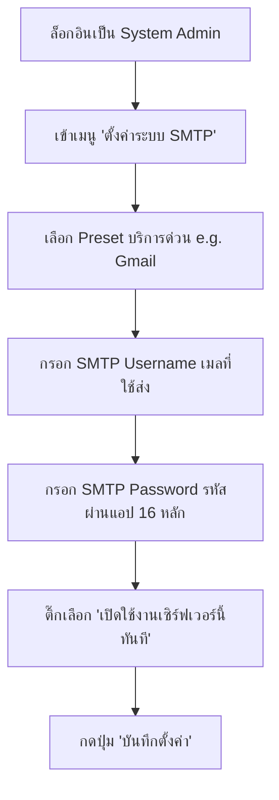

# 📧 คู่มือการตั้งค่า SMTP สำหรับจัดส่งอีเมลแจ้งเตือน (Outbound SMTP Configuration Guide)

คู่มือนี้อธิบายวิธีการตั้งค่าระบบส่งอีเมลจริงของ TicketSolve ผ่านหน้าเว็บ ทั้งสำหรับการจัดตั้งบริการส่งเมลของ **Gmail (Google)**, **Microsoft Outlook (Office 365)** และ **เซิร์ฟเวอร์แบบกำหนดเอง (Custom SMTP)**

---

## 📌 สรุปพารามิเตอร์การตั้งค่าหลัก (SMTP Server Parameters)

เมื่อคุณกรอกการตั้งค่า SMTP ในจุดจัดการระบบ ให้เลือก Preset ที่ต้องการ ซึ่งระบบจะกรอกค่าเซิร์ฟเวอร์พื้นฐานให้อัตโนมัติ:

| ผู้ให้บริการ (Provider Preset) | SMTP Host | SMTP Port | TLS Encryption | คำแนะนำเพิ่มเติม |
| :--- | :--- | :--- | :--- | :--- |
| **Gmail SMTP** | `smtp.gmail.com` | `587` | เปิดใช้งาน (TLS) | ต้องใช้รหัสผ่านแอป 16 หลัก |
| **Microsoft Outlook** | `smtp.office365.com` | `587` | เปิดใช้งาน (TLS) | ต้องใช้รหัสผ่านแอป 16 หลัก |
| **Simulation / Console** | `localhost` | `1025` | ปิดใช้งาน | ส่งออกทางหน้าจอ Console สำหรับจำลองระบบ |
| **Custom SMTP** | ระบุเอง (เช่น `smtp.mailgun.org`) | ระบุเอง (เช่น `465` หรือ `587`) | ขึ้นอยู่กับผู้ให้บริการ | ใช้ข้อมูลโฮสต์/สิทธิ์จากผู้บริการค่ายนั้นๆ |

---

## 🔑 วิธีการขอรหัสผ่านแอป (App Password) จากผู้ให้บริการ

> [!IMPORTANT]
> ในปัจจุบัน ทั้ง Google และ Microsoft ได้ยกเลิกการล็อกอินระบบด้วยรหัสผ่านบัญชีจริงโดยตรงผ่าน SMTP แล้ว (เพื่อความปลอดภัยระดับสากล) คุณจำเป็นต้องสร้าง **รหัสผ่านแอป (App Password) 16 หลัก** มาใช้งานแทนรหัสผ่านปกติ

### 1. วิธีสร้างรหัสผ่านแอปของ Google Account (Gmail)

1. เข้าไปที่หน้าการจัดการบัญชี [Google Account](https://myaccount.google.com/) ของคุณ
2. คลิกเลือกเมนู **"ความปลอดภัย" (Security)** ทางด้านซ้ายมือ
3. ในกล่อง "วิธีการลงชื่อเข้าใช้ Google" ให้ตรวจสอบว่าเปิดใช้งาน **"การยืนยันสองขั้นตอน" (2-Step Verification)** แล้ว (หากยังไม่ได้เปิด ให้กดเปิดใช้งานให้เสร็จสิ้น)
4. คลิกเข้าไปที่เมนู **"การยืนยันสองขั้นตอน" (2-Step Verification)** เลื่อนลงมาล่างสุด จะเจอปุ่ม **"รหัสผ่านสำหรับแอป" (App passwords)**
5. ป้อนชื่อแอปพลิเคชันเพื่อช่วยจำ (เช่น `TicketSolve SMTP`) แล้วกดปุ่ม **"สร้าง" (Create)**
6. ระบบ Google จะแสดงกล่องรหัสผ่านแอปจำนวน **16 ตัวอักษร** (เช่น `xqpu ibhg nwon xpqe`)
7. **คัดลอกรหัสผ่าน 16 หลักนี้ไว้** เพื่อนำไปกรอกลงช่องรหัสผ่านในหน้าระบบ TicketSolve

### 2. วิธีสร้างรหัสผ่านแอปของ Microsoft Account (Outlook / Office 365 / Microsoft 365)

1. เข้าสู่หน้าจัดการบัญชีไมโครซอฟท์ที่ [Microsoft Account Security](myaccount.google.com/apppasswords)
2. ลงชื่อเข้าใช้งานด้วยบัญชีอีเมลของคุณ (เช่น `@outlook.com`, `@hotmail.com` หรือบัญชีอีเมลองค์กร Microsoft 365)
3. เลือกหัวข้อ **"ตัวเลือกความปลอดภัยขั้นสูง" (Advanced security options)**
4. ตรวจสอบให้แน่ใจว่าได้เปิดใช้งาน **"การตรวจสอบสองขั้นตอน" (Two-step verification)** เรียบร้อยแล้ว (หากยังไม่เปิด ให้เปิดใช้งานโดยผูกเบอร์โทรศัพท์หรือแอป Authenticator ก่อน)
5. เลื่อนหน้าจอลงมาด้านล่าง มองหาหัวข้อ **"รหัสผ่านของแอป" (App passwords)** จากนั้นคลิก **"สร้างรหัสผ่านแอปใหม่" (Create a new app password)**
6. ระบบของ Microsoft จะสุ่มรหัสผ่านแอปความปลอดภัยมาให้ทันที (ความยาว 16 หลัก)
7. **คัดลอกรหัสผ่านนี้เก็บไว้** เพื่อใช้กรอกในช่องรหัสผ่าน SMTP ของระบบ TicketSolve

---

## 🖥️ ขั้นตอนการกรอกตั้งค่าในหน้าระบบ TicketSolve

เมื่อพร้อมใช้งานข้อมูลโฮสต์และรหัสผ่านแอปแล้ว ให้ทำตามขั้นตอนการกรอกข้อมูลดังนี้:

1. **ล็อกอินเข้าสู่ระบบ** ด้วยสิทธิ์บัญชี **System Administrator** (`narunaithaisenee@gmail.com`)
2. คลิกที่เมนู **"ตั้งค่าระบบ SMTP"** บนแถบเมนูด้านซ้ายมือ (Sidebar)
3. ป้อนข้อมูลในฟอร์มด้านซ้าย:
   * **ชื่อเซิร์ฟเวอร์**: ตั้งชื่อตามใจชอบ (เช่น `Gmail หลักของนรนัย` หรือ `Outlook บริษัท A`)
   * **ผู้ให้บริการ**: เลือกPreset (เช่น `Gmail SMTP` หรือ `Microsoft Outlook SMTP`) 
     *(ระบบจะกรอกค่า Host, Port และเลือกใช้ TLS ให้ทันที)*
   * **ชื่อผู้ใช้**: ป้อนอีเมลผู้ใช้งานของคุณ (เช่น `narunaithaisenee@gmail.com`)
   * **รหัสผ่านแอป**: ป้อนรหัสผ่านแอป 16 หลักที่ขอมาได้ในขั้นตอนก่อนหน้านี้
   * **เปิดใช้งานเซิร์ฟเวอร์นี้ทันที (Set Active)**: ติ๊กถูก เพื่อให้ระบบเปลี่ยนมาจัดส่งผ่านอีเมลบัญชีนี้ทันที
4. กดปุ่ม **"💾 บันทึกตั้งค่า"**
5. ตรวจสอบผลลัพธ์ในตารางขวามือ: แถบสถานะต้องขึ้นตัวสีเขียว **ACTIVE** หน้าชื่อเซิร์ฟเวอร์นั้นๆ

---

## 🧪 ขั้นตอนการตรวจสอบและทดสอบการส่งเมลออกจริง

หลังจากกดเปิดการตั้งค่า Active แล้ว คุณสามารถทำการทดสอบว่าเมลถูกส่งออกจริงได้ผ่าน 2 วิธีดังนี้:

### วิธีที่ 1: ตรวจสอบทางหน้าจอพรีวิวมือถือ/เบราว์เซอร์
1. คลิกเข้าสู่เมนู **"รายงานประจำเดือน (PDF)"**
2. เลือกบริษัทที่คุณต้องการส่งรายงาน (เช่น `Company A`)
3. เลือกผู้รับเป็น **ส่งหาพนักงานเจาะจงบุคคล** หรือเลือก **ส่งหาทุกคนในบริษัท**
4. **เลือกบัญชีอีเมลผู้ส่ง (Send From Account)**: สามารถกดเลือกบัญชีอีเมล SMTP ที่ได้ลงทะเบียนไว้ในหน้าต่างตั้งค่า ว่าจะใช้เมลใดจัดส่ง หรือเลือก "ใช้บัญชี Active เริ่มต้น" ของระบบ
5. กดปุ่ม **"📧 จัดส่งทางอีเมลทันที"**
6. ตัวระบบจะทำงานเชื่อมต่อไปยังโฮสต์ SMTP จริงตามบัญชีที่คุณเลือกไว้ข้างต้น ถ้าสำเร็จจะขึ้นข้อความกล่องสีเขียวแจ้งเตือนด้านบนว่า *"จัดส่งรายงานประจำเดือนให้ทุกคนสำเร็จเรียบร้อยแล้ว!"*
7. ให้เข้าไปเช็คกล่องจดหมายอีเมลผู้รับว่าได้รับไฟล์แนบ PDF หรือไม่

### วิธีที่ 2: ตรวจสอบผ่านตารางประวัติระบบ (Audit Logs Table)
1. ไปที่เมนู **"ประวัติ & Log ระบบ"**
2. ตรวจสอบตาราง **"ประวัติการแจ้งเตือนทางอีเมล (Email Notification Logs)"**
3. ระบบจะบันทึกสถานะการยิงส่งอีเมลทั้งหมด หากเซิร์ฟเวอร์ SMTP ยิงออกสำเร็จ แถวสถานะในระบบจะขึ้นคำว่า **SUCCESS** สีเขียว หากผิดพลาดหรือรหัสแอปไม่ถูกต้องระบบจะฟ้องสถานะ **FAILED** สีแดงเพื่อใช้ในการตรวจสอบข้อผิดพลาดทันที
