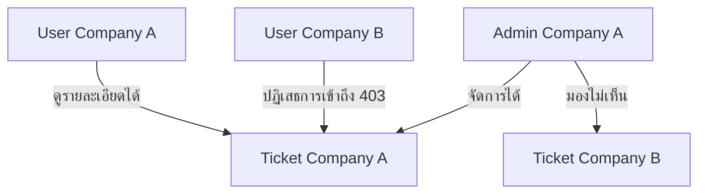

# คู่มือการทดสอบระบบและสถาปัตยกรรมเทคโนโลยี (Tech Stack & Testing Guide)

เอกสารฉบับนี้อธิบายถึงโครงสร้างเทคโนโลยี (Tech Stack) และขั้นตอนการทดสอบระบบจัดการแจ้งปัญหาแยกข้อมูลองค์กร (Multi-tenant Ticket System) 

---

## 🛠️ โครงสร้างเทคโนโลยีที่ใช้ (Tech Stack Overview)

* **Backend Framework**: **Python 3.12+** ร่วมกับ **Django 6.0+**
  * ใช้ Django ORM สำหรับจัดการความสัมพันธ์ฐานข้อมูล
  * ใช้ Django Custom User Model (`tickets.CustomUser`) เพื่อขยายขีดความสามารถการแบ่งระดับสิทธิ์
* **Frontend Design System**: HTML5, Django Template Engine ร่วมกับ **Tailwind CSS CDN** และฟอนต์ **Inter & Prompt**
  * รูปแบบดีไซน์แบบ Premium Dark Mode & Glassmorphic layouts เพื่อความทันสมัย
* **Database (ฐานข้อมูล)**: **SQLite** (ใช้สำหรับระบบพัฒนาในเครื่องและทดสอบ Unit Tests) และโครงสร้างรองรับ **PostgreSQL** ด้วย `psycopg2-binary` ในอนาคต
* **Mail Simulation**: **Django Console Email Backend** (จำลองการยิงอีเมลออกผ่านหน้าจอคอนโซลโดยตรงเพื่อการทดสอบที่รวดเร็ว)
* **Production Web Server**: **Gunicorn** และ **Dockerfile** แบบ Multi-stage (python:3.12-slim) สำหรับรันเป็นคอนเทนเนอร์บน Azure App Service

---

## 🚀 ขั้นตอนการติดตั้งและเปิดใช้งานเซิร์ฟเวอร์ (Setup & How to Run)

ก่อนที่จะเริ่มทดสอบและเปิดใช้งานเซิร์ฟเวอร์ ให้ทำตามขั้นตอนการตั้งค่าเหล่านี้ใน Terminal:

### 1. ติดตั้งไลบรารีที่จำเป็น (Dependencies Installation)
ติดตั้ง Django และแพ็กเกจอื่นๆ ที่เกี่ยวข้อง:
```powershell
python -m pip install -r requirements.txt
```

### 2. ทำการสร้างโครงสร้างฐานข้อมูล (Database Migration)
สร้างและประยุกต์ใช้ตารางข้อมูลทั้งหมดลงในฐานข้อมูล SQLite:
```powershell
python manage.py makemigrations
python manage.py migrate
```

### 3. เตรียมข้อมูลทดสอบล่วงหน้า (Database Seeding)
สร้างข้อมูลตัวอย่าง เช่น บริษัท บัญชีผู้ใช้ของแต่ละบริษัท และ Ticket สำหรับทดสอบระบบ:
```powershell
python manage.py seed_data
```

### 4. เปิดใช้งานเซิร์ฟเวอร์ 
เริ่มการรันเว็บเซิร์ฟเวอร์ภายในเครื่อง:
```powershell
python manage.py runserver
```
เมื่อเซิร์ฟเวอร์เริ่มทำงานแล้ว คุณสามารถเข้าทดสอบหน้าเว็บได้ที่: [http://127.0.0.1:8000/](http://127.0.0.1:8000/)

---

## 📦 ข้อมูลบัญชีผู้ใช้สำหรับทดสอบ (Seeded Accounts)

ในการล้างข้อมูลและทดสอบ สามารถสั่งรันคำสั่ง Seeding:
```powershell
python manage.py seed_data
```

หลังจากนั้น จะมีบัญชีที่ตั้งรหัสผ่านเดียวกันคือ **`password123`** ดังต่อไปนี้:

| Username | สิทธิ์การเข้าถึง (Role) | สังกัดองค์กร (Company) | ขอบเขตการทำงาน |
| :--- | :--- | :--- | :--- |
| **`system_admin`** | System Administrator | ส่วนกลาง (No Company) | เห็นและจัดการได้ทุกอย่างในระบบ |
| **`admin_a`** | Client Administrator | บริษัท เอ จำกัด (Company A) | จัดการ Ticket และพนักงานเฉพาะในบริษัท A เท่านั้น |
| **`user_a`** | Client User | บริษัท เอ จำกัด (Company A) | แจ้งปัญหาและดูความคืบหน้าของตนเองในบริษัท A |
| **`admin_b`** | Client Administrator | บริษัท บี จำกัด (Company B) | จัดการ Ticket และพนักงานเฉพาะในบริษัท B เท่านั้น |
| **`user_b`** | Client User | บริษัท บี จำกัด (Company B) | แจ้งปัญหาและดูความคืบหน้าของตนเองในบริษัท B |

---

## 🧪 ขั้นตอนการทดสอบระบบ (Manual & Automated Testing Scenarios)

### 1. การตรวจสอบความปลอดภัยการแบ่งแยกข้อมูล (Tenant Isolation Check)

การแบ่งแยกข้อมูลแบบ Row-level Isolation จะถูกทดสอบผ่านสคริปต์อัตโนมัติและสิทธิ์การเข้าถึงผ่าน Web UI:



* **การทดสอบผ่าน Command Line (Automated Tests)**:
  รันคำสั่งทดสอบ Unit Tests ของระบบ:
  ```powershell
  python manage.py test
  ```
  *คำสั่งนี้จะทดสอบสร้างข้อมูลเสมือน ค้นหา ดึงสิทธิ์ และตรวจสอบว่าเกิดข้อผิดพลาด 403 หรือไม่หากพยายามเจาะข้อมูลข้ามบริษัท*

* **การทดสอบผ่านหน้าเว็บ (Manual Verification)**:
  1. ล็อกอินระบบที่ [http://127.0.0.1:8000/](http://127.0.0.1:8000/) ด้วยบัญชี `user_a` จะต้องเห็นเฉพาะรายการแจ้งปัญหาของ บริษัท เอ เท่านั้น
  2. เมื่อออกจากระบบแล้วล็อกอินเข้าใช้งานด้วยบัญชี `user_b` จะต้องไม่สามารถตรวจสอบรายการของบริษัท เอ ได้
  3. หากพยายามพิมพ์ URL ตรงเพื่อเข้าดู Ticket ข้ามบริษัท เช่น [http://127.0.0.1:8000/ticket/1/](http://127.0.0.1:8000/ticket/1/) ขณะใช้บัญชีของบริษัทอื่น ระบบต้องปฏิเสธทันที (403 Forbidden)

### 2. การควบคุมสิทธิ์หน้าจัดการระบบแบบคัสตอม (Custom Admin Dashboard Check)

1. เข้าหน้าหลักระบบที่ [http://127.0.0.1:8000/](http://127.0.0.1:8000/) 
2. ล็อกอินด้วยบัญชี `admin_a` (Client Admin ของบริษัท A)
3. ตรวจสอบเมนูนำทางใน Sidebar และการเข้าถึง:
   * จะต้องมีปุ่ม **"จัดการบัญชีผู้ใช้"** ปรากฏขึ้นมาใน Sidebar แต่จะ **ไม่มี** ปุ่ม **"จัดการองค์กร/บริษัท"**
   * เมื่อคลิกเข้าไปที่หน้าจัดการบัญชีผู้ใช้ (หรือเข้าตรงที่ `/users/`) จะต้องเห็นเฉพาะรายชื่อพนักงานที่สังกัด **บริษัท เอ เท่านั้น** (ไม่เห็น `user_b` ของบริษัท B)
   * เมื่อกดปุ่ม **"เพิ่มผู้ใช้งานใหม่"** ระบบจะบังคับให้ผู้ใช้ใหม่สังกัดบริษัท เอ โดยอัติโนมัติ
   * หากพยายามพิมพ์ URL ตรงเพื่อเข้าไปจัดการบริษัทที่ `/companies/` ระบบจะต้องปฏิเสธและขึ้นหน้าจอ **403 Forbidden** หรือโยนข้อผิดพลาดสิทธิ์การเข้าถึงทันที

4. ล็อกอินด้วยบัญชี `system_admin` (System Admin)
5. ตรวจสอบเมนูนำทางใน Sidebar และการเข้าถึง:
   * จะต้องมีปุ่มควบคุมทั้งสองส่วนปรากฏขึ้นมา ได้แก่ **"จัดการบัญชีผู้ใช้"** และ **"จัดการองค์กร/บริษัท"**
   * ในหน้าจัดการบัญชีผู้ใช้ จะเห็นบัญชีสมาชิกผู้ใช้งานของทุกบริษัททั้งหมดในระบบ และสามารถเพิ่ม/แก้ไข พร้อมเลือกบริษัทให้ผู้ใช้ได้อย่างอิสระ
   * ในหน้าจัดการองค์กร/บริษัท (หรือที่ `/companies/`) จะเห็นรายชื่อบริษัทลูกค้าทั้งหมด และสามารถกดเพิ่มบริษัทใหม่เข้าระบบได้

### 3. การรวบรวมรายงานส่งออกและแจ้งเตือน (Email & Batch Reports)

* **ทดสอบระบบแจ้งเตือนแบบเรียลไทม์ (Django Signals)**:
  * เมื่อล็อกอินด้วยบัญชีใดๆ แล้วทำรายการเปิด Ticket ใหม่ หรือแอดมินแก้ไขสถานะ หน้าจอคอนโซลที่รันเซิร์ฟเวอร์จะพิมพ์โครงสร้างอีเมลจำลองส่งหาผู้ใช้และแอดมินบริษัทนั้นๆ โดยอัตโนมัติ
* **ทดสอบคำสั่ง Batch ส่งรายงานสิ้นเดือน (Django Command)**:
  * รันคำสั่งจำลองกระบวนการรวบรวมข้อมูล Ticket แยกตามบริษัทและส่งออกรายงาน:
    ```powershell
    python manage.py send_monthly_report
    ```
    *หน้าจอจะรวบรวมจำนวน Ticket ที่เปิดอยู่และปิดแล้วสรุปพิมพ์ออกมาเป็นอีเมลจำลองไปยัง Client Admin แต่ละองค์กร*
